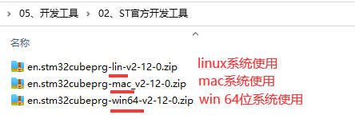

# 2.1  STM32CubeProgrammer简介

&emsp;&emsp;STM32CubeProgrammer 简称 STM32CubeProg，是一个适用于 STM32 系列产品的跨平台、多合一的程序烧写工具。正点原子ATK-DLMP135开发板可采用该工具来进行系统烧写。

&emsp;&emsp;如下特点： 
&emsp;&emsp;（1）“跨平台”，体现在支持 Windows、macOS 和 Linux 操作系统，软件运行时需要 Java 环境。
&emsp;&emsp;（2）“多合一”，体现在支持通过USB、ST-LINK、UART、OTA多种方式来烧写固件。

&emsp;&emsp;为方便用户使用，我们已从ST官网下载好STM32CubeProgrammer工具，存放路径为`开发板光盘A-基础资料->05、开发工具->02、ST官方开发工具`。ST提供三种系统下的工具支持，分别为linux、mac和windows，由于我们条件有限，下面只讲Windows和Linux的STM32CubeProgrammer安装及使用。

 
图2.1.1 ST官方开发工具

