# 2.2 Windows下烧写系统到开发板

## 2.2.1 Windows安装STM32CubeProgrammer

&emsp;&emsp;解压en.stm32cubeprg-win64-v2-12-0.zip安装包，双击SetupSTM32CubeProgrammer_win64.exe进行安装。

&emsp;&emsp;弹出的欢迎安装界面，直接点击下一步；（此后的操作基本都是点击下一步即可）

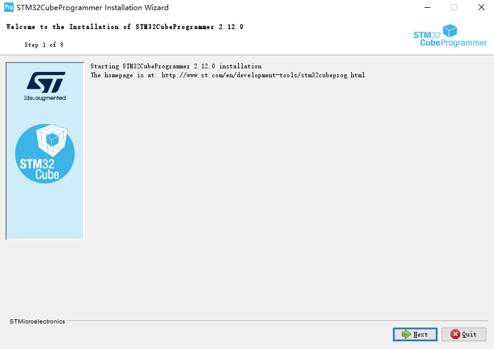 
图2.2.1.1 STM32CubeProgrammer欢迎安装界面

&emsp;&emsp;阅读STM32CubeProgrammer的信息，直接点下一步；

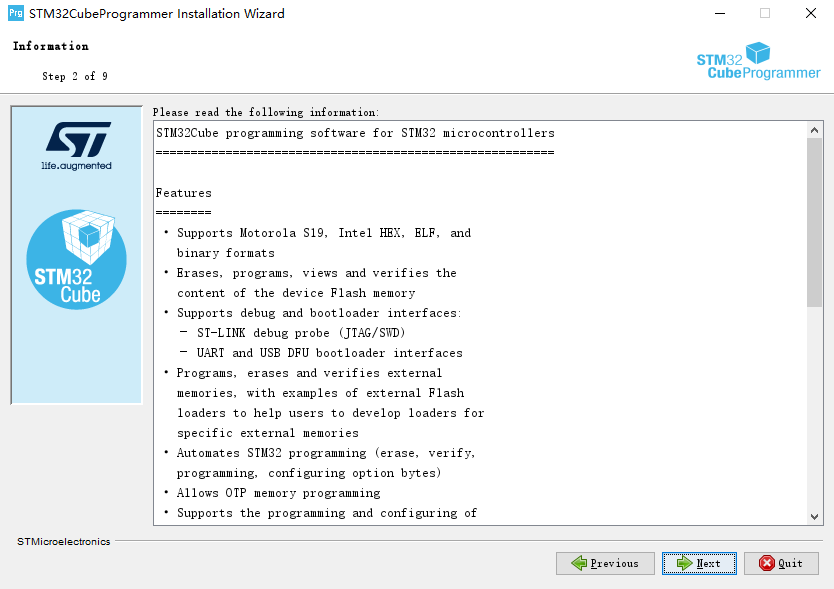 
图2.2.1.2阅读相关信息

&emsp;&emsp;勾选同意license，点击下一步；

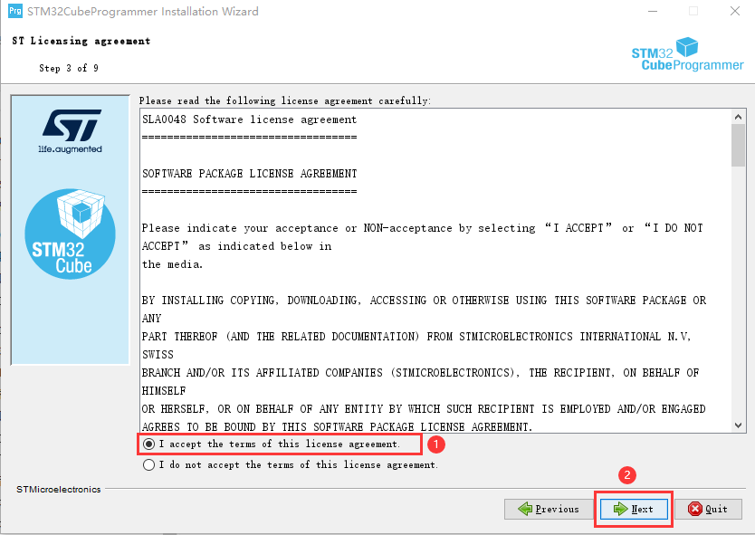 
图2.2.1.3同意条款，点下一步

&emsp;&emsp;已读条款，点下一步；

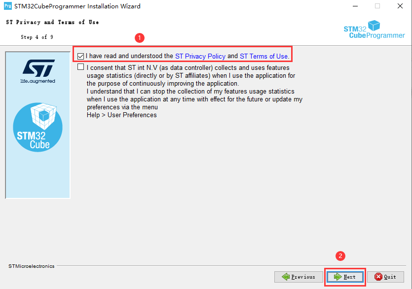 
图2.2.1.4已读条款，点下一步

&emsp;&emsp;请选择要安装的路径，可自行修改安装路径，点下一步；

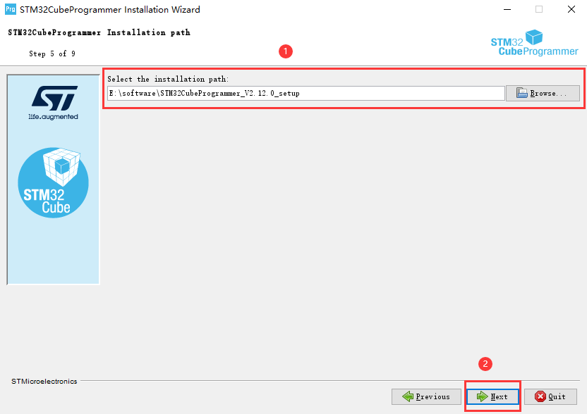 
图2.2.1.5选择安装路径，点下一步

&emsp;&emsp;勾选需要安装选项，我们直接默认即可，点下一步；

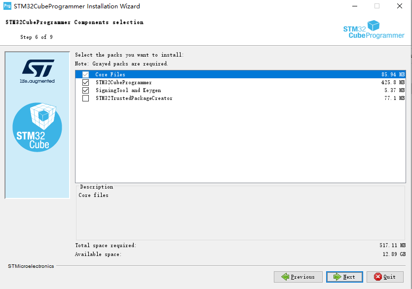 
图2.2.1.6默认安装选项，点下一步

&emsp;&emsp;正在安装；

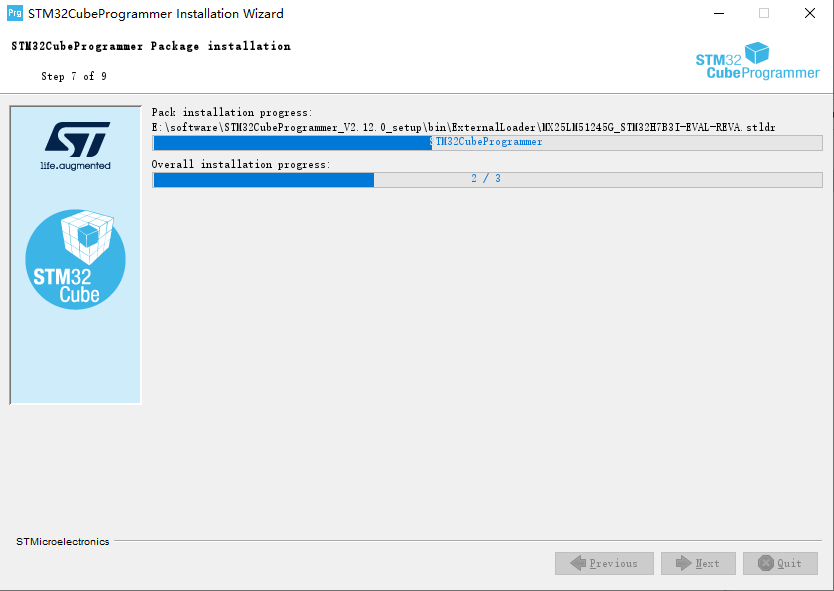 
图2.2.1.7正在安装

&emsp;&emsp;安装期间会弹出是否要安装一些驱动，我们选择始终安装此驱动程序。

&emsp;&emsp;弹出驱动安装界面，点击下一步；

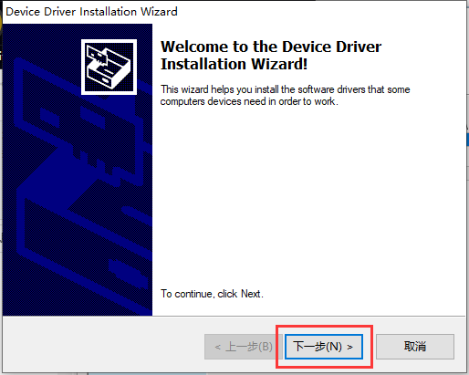 
图2.2.1.8点击下一步，安装此驱动

&emsp;&emsp;设备驱动安装完成，点击完成；

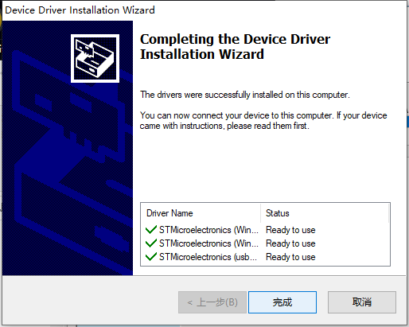 
图2.2.1.9驱动安装完成

&emsp;&emsp;安装完成后，点击下一步；

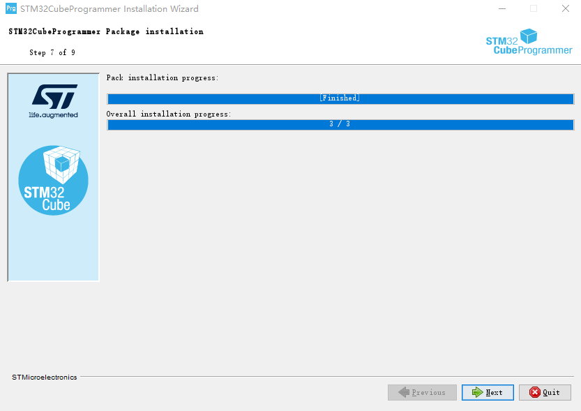 
图2.2.1.10 STM32CubeProgrammer安装完成状态

&emsp;&emsp;默认会生成桌面快捷方式，点击下一步；

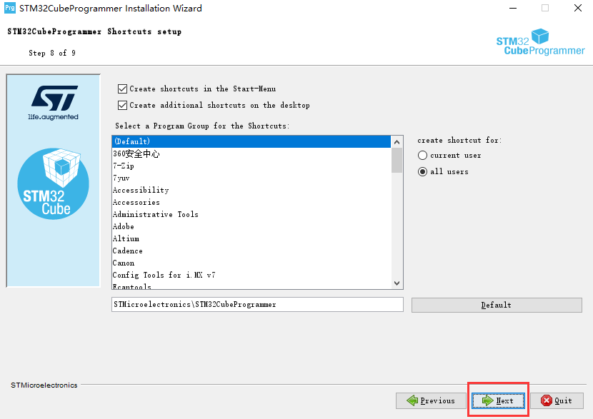 
图2.2.1.11点击下一步，生成STM32CubeProgrammer快捷方式

&emsp;&emsp;点击Done，完成安装。

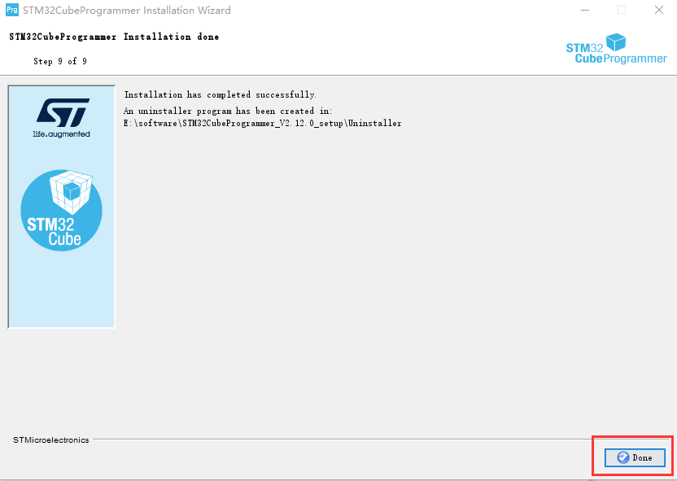 
图2.2.1.12安装完成

&emsp;&emsp;桌面生成快捷方式如下。 

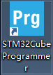 
图2.2.1.13生成的桌面快捷方式

&emsp;&emsp;双击STM32CubeProgrammer快捷方式打开出现如下界面，说明安装完成，软件运行正常。

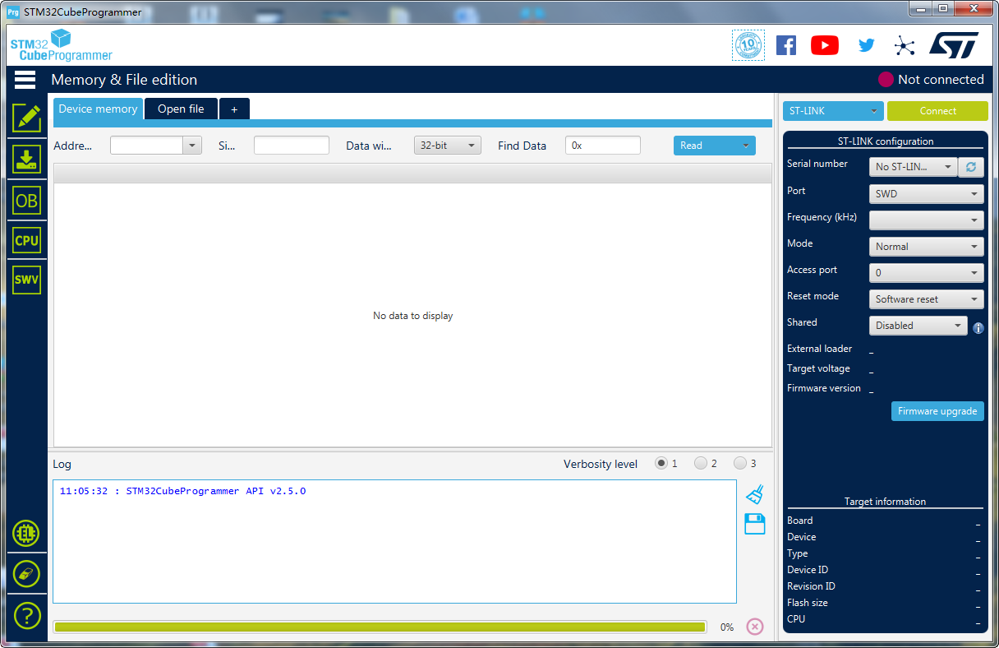 
图2.2.1.14 STM32CubeProgrammer启动后的界面

## 2.2.2 Windows使用STM32CubePro烧写系统到eMMC

&emsp;&emsp;ATK-DLMP135开发板插上电源，拨码开关选择为000（USB模式），将一根USB Type-C数据线连接到底板USB_OTG，再连接到PC（电脑）的**USB 3.0**接口（一般是内部是蓝色的就是USB 3.0接口，不要连接到USB 2.0接口，否则烧写很慢！经过实测，如果烧写时间很长，说明您的USB 3.0接口可能不是真正的USB 3.0接口，实质是USB 2.0）。另一根USB Type-C数据线连接到底板USB_TTL（串口非必需连接，目的是观察一些打印信息）。然后开发板上电。

&emsp;&emsp;双击STM32CubeProgrammer桌面图标打开STM32CubeProgrammer界面。按如下步骤，选择设备类型为USB，点击刷新设备，刷新不出来可以重新上电（注意不要将此USB设备连接到Ubuntu虚拟机上去了）。如下图，出现USB1表明成功！

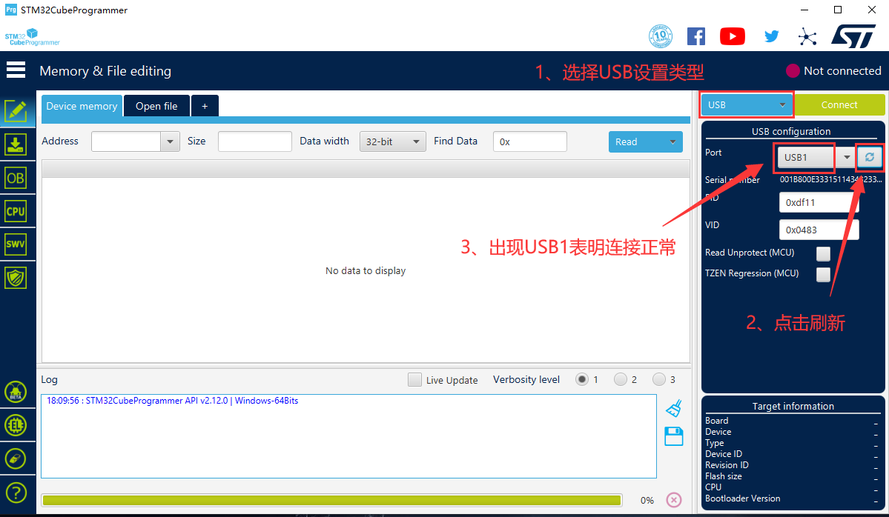 
图2.2.2.1识别出USB1

&emsp;&emsp;按下图步骤，打开烧写到eMMC的tsv配置文件，网盘路径为`STM32MP135开发板->开发板光盘A-基础资料->08、系统镜像->01、出厂系统镜像->01、STM32CubeProg烧录固件包-> flashlayout_atk-image->optee`，STM32CubeProgrammer会读取此配置文件将系统烧写到eMMC。

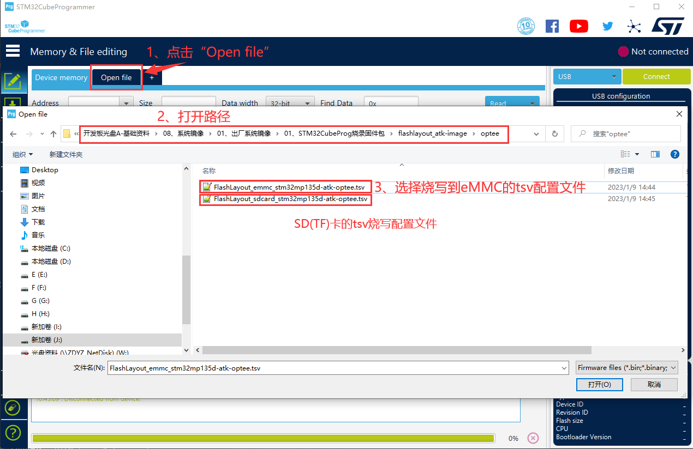 
图2.2.2.2选择烧写到eMMC的配置文件

&emsp;&emsp;浏览烧写系统所在目录，路径为`STM32MP135开发板->开发板光盘A-基础资料->8、系统镜像->2、出厂系统镜像->1、STM32CubeProg烧录固件包`。（用户经常定位错目录，请注意不要选错自己的固件路径）

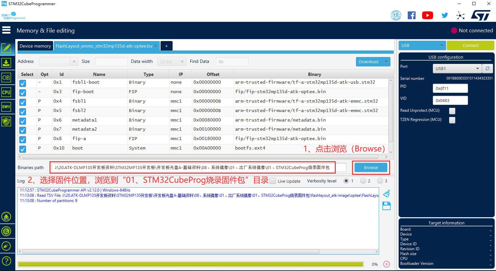 
图2.2.2.2浏览烧写系统所在目录

&emsp;&emsp;确认连接信息，直接点击Download（下载）。

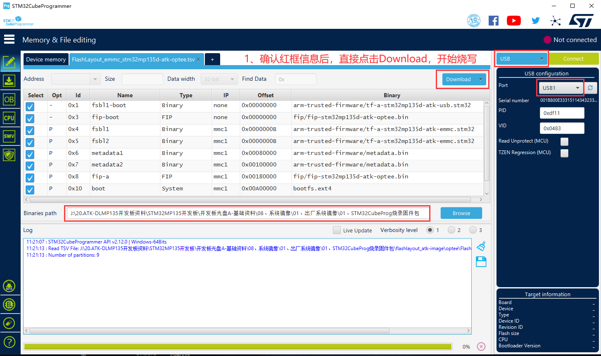 
图2.2.2.3点击下载，开始烧写

&emsp;&emsp;正在烧写中，烧写过程中会**重连**接开发板，注意，如果您正在使用Ubuntu虚拟机，不要让开发板连接到Ubuntu虚拟机上去了。

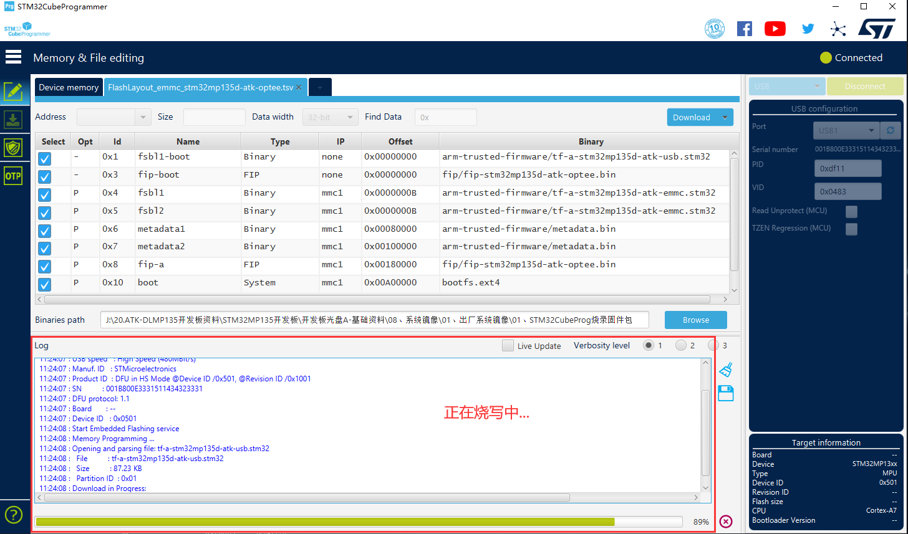 
图2.2.2.4正在烧写

&emsp;&emsp;烧写过程使用PC（电脑）USB3.0接口，烧写速度较快，约几分钟就可以烧写好整个系统。如果用户电脑没有USB 3.0接口，使用USB 2.0会相当慢（可能几十分钟）。

&emsp;&emsp;这里提示一点，当需要多次烧写系统时，如果用户不想更新板子文件系统，我们可以编辑FlashLayout_emmc_stm32mp135d-atk-optee.tsv文件，将烧写文件系统的配置信息即最后一行，将“P”修改为“PE”，即代表跳过，不烧写。

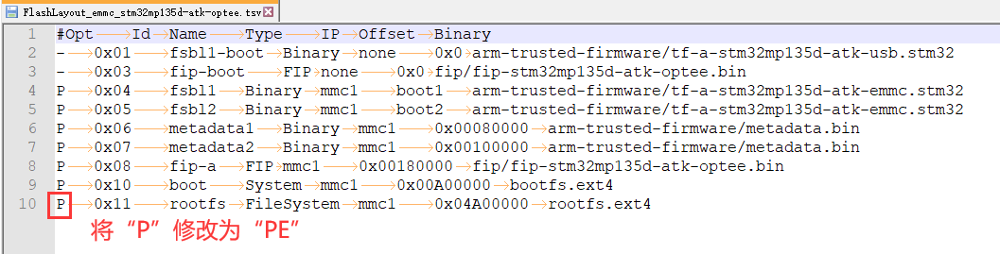 
图2.2.2.5可跳过文件系统烧写

&emsp;&emsp;烧写完成如下图，拨码到010，eMMC启动即可。

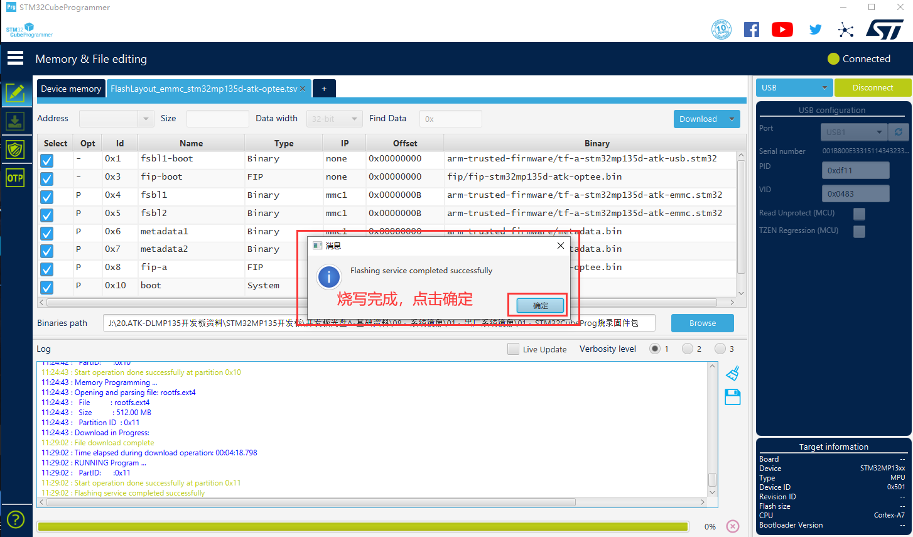 
图2.2.2.6烧写完成

## 2.2.3 Windows使用STM32CubePro烧写系统到TF (SD)卡

&emsp;&emsp;请参考上面2.2.2小节烧写到eMMC的方法，选择烧写到TF卡的FlashLayout_sdcard_stm32mp135d-atk-optee.tsv配置文件即可。记住烧写到TF卡时，需要在底板上插入TF卡且要确保底板将供电跳线帽切换到供电TF卡，而不是供电到WIFI模组。

&emsp;&emsp;烧写完成后，拨码到101，SD卡（TF卡）启动即可。

