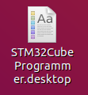
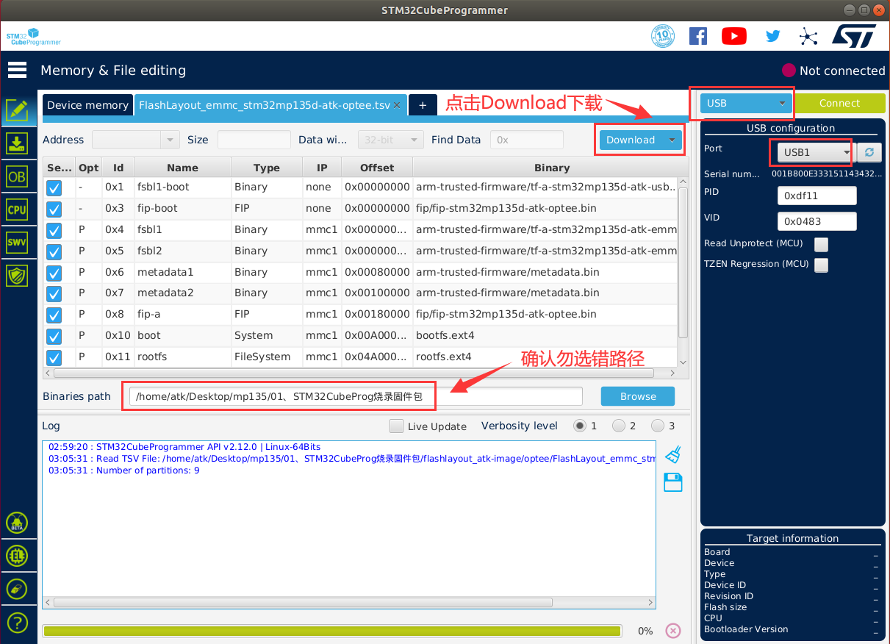

# 2.3 Linux下烧写系统到开发板

&emsp;&emsp;上面介绍了在Windows系统下使用STM32CubeProgrammer工具进行系统烧写，那么是否可以在Linux下进行系统烧写呢，答案是可以的。对于有需要在Ubuntu下烧写系统的用户，请按下面方法操作。

## 2.3.1 Linux下安装STM32CubeProgrammer

&emsp;&emsp;本节将在Ubuntu18.04系统下安装STM32CubeProgrammer，其他系统版本可自行尝试。

&emsp;&emsp;首先拷贝**05、开发工具\02、ST官方开发工具**中的en.stm32cubeprg-lin-v2-12-0.zip压缩包文件到Ubuntu任意目录下，比如编者创建了一个“tool”目录，专用于存放或安装工具软件。

&emsp;&emsp;执行下面指令解压文件。

```c#
unzip en.stm32cubeprg-lin-v2-12-0.zip
```

<center>
<br />
图2.3.1.1解压文件
</center>

&emsp;&emsp;直接运行SetupSTM32CubeProgrammer-2.12.0.linux安装即可。

```c#
sudo ./SetupSTM32CubeProgrammer-2.12.0.linux  //用户最好加sudo，和编者环境一样，加sudo默认是安装到/usr/local/下
```


<center>
<br />
图2.3.1.2执行安装
</center>

&emsp;&emsp;安装步骤与2.2.1小节Windows的基本一样，请参考2.2.1小节，基本都是按下一步，安装的位置按软件的默认安装位置即可，这里不再重复安装步骤。

<center>
<br />
图2.3.1.3安装界面
</center>

&emsp;&emsp;安装完成后，下面有2种方法可打开STM32CubeProgrammer界面。

&emsp;&emsp;方法一：图标打开STM32CubeProgrammer

&emsp;&emsp;安装完成后会在桌面生成图标，如下图，这个图标我们双击它，（Ubuntu18.04环境）会弹窗提示，我们选择Trust & Launch（信任并启动）。


<center>
<br />
图2.3.1.4未变化的桌面图标
</center>

&emsp;&emsp;图标就会变成如下，继续往下看。

<center>
<br />
图2.3.1.5改变的桌面图标
</center>

&emsp;&emsp;接着会弹出“Usage statistics”窗口，选择“No,thanks”即可。接着就能自动弹出STM32CubeProgrammer界面了。

<center>
<br />
图2.3.1.6使用统计
</center>

<center>
<br />
图2.3.1.7 STM32CubeProgrammer界面
</center>

&emsp;&emsp;方法二：命令行打开STM32CubeProgrammer

&emsp;&emsp;配置STM32CubeProgrammer的环境变量，这样我们就可以在命令行下使用指令打开STM32CubeProgrammer。

&emsp;&emsp;编辑/etc/profile文件。

```c#
sudo vi /etc/profile
```

&emsp;&emsp;在/etc/profile末尾添加以下内容，输入完成后按Esc，再按:wq保存退出。

```c#
export PATH=$PATH:/usr/local/STMicroelectronics/STM32Cube/STM32CubeProgrammer/bin/
```

<center>
<br />
图2.3.1.8在末行写入环境变量
</center>

&emsp;&emsp;配置完成后，使能环境变量（每次启动前都需要source /etc/profile）。

```c#
source /etc/profile
```

<center>
<br />
图2.3.1.9使能环境变量
</center>

&emsp;&emsp;我们就可以在终端里使用指令打开STM32CubeProgrammer。

```c#
STM32CubeProgrammer
```

&emsp;&emsp;至此安装STM32CubeProgrammer完成。

&emsp;&emsp;在Ubuntu使用 USB 端口连接 STM32 器件，还需要安装 libusb1.0 软件包。

```c#
sudo apt-get install libusb-1.0.0-dev
```

&emsp;&emsp;要使用ST-LINK工具或USB DFU连接到目标，需要将位于STM32CubeProgrammer 安装目录下的Drivers/rules目录下的规则文件复制到Ubuntu的/etc/udev/rules.d/目录中。如果用户安装 STM32CubeProgrammer 时是使用默认安装目录，则直接使用下面的指令拷贝规则文件到Ubuntu的/etc/udev/rules.d目录下。

```c#
sudo cp /usr/local/STMicroelectronics/STM32Cube/STM32CubeProgrammer/Drivers/rules/*.* /etc/udev/rules.d/ 
```

&emsp;&emsp;通过上面2个步骤，STM32CubeProgrammer工具将可正常识别USB目标设备。

&emsp;&emsp;ATK-DLMP135开发板插上电源，拨码开关选择为000（USB模式），将一根USB Type-C数据线连接到底板USB_OTG接口，再连接到PC（电脑）的**USB 3.0**接口（一般是内部是蓝色的就是USB 3.0接口，不要连接到USB 2.0接口，否则烧写很慢！）。另一根USB Type-C数据线连接到底板USB_TTL（串口非必需连接，目的是观察一些打印信息）。然后开发板上电。

&emsp;&emsp;注意：Ubuntu虚拟机要设置USB 兼容USB 3.0。如下图步骤，选择USB 3.0。


<center>
<br />
图2.3.1.10虚拟机选择兼容USB 3.0
</center>

&emsp;&emsp;Ubuntu18.04虚拟机弹出以下窗口，我们将STMicroelectronic DFU in HS…(编者在Windows安装过STM32CubeProgrammer的DFU驱动，如果用户没安装过则不一定是这个名字)连接到虚拟机，选择接到Ubuntu 180405（您的Ubuntu主机名）。再点击确认。

<center>
<br />
图2.3.1.11连接设备到Ubuntu虚拟机
</center>

&emsp;&emsp;如果没弹出上面的窗口也没关系，直接在虚拟机（M）将STMicroelectronic DFU in HS…这个设备点击“连接（断开与主机的连接）（C）”选项也可以将开发板设备连接到虚拟机。

<center>
<br />
图2.3.1.12连接设备到Ubuntu虚拟机
</center>

&emsp;&emsp;双击STM32CubeProgrammer桌面图标打开，或者在终端使能环境变量后输入“STM32CubeProgrammer”打开STM32CubeProgrammer。按如下步骤，选择设备类型为USB，点击刷新设备，刷新不出来可以给开发板重新上电。如下图，出现USB1表示连接开发板成功！

<center>
<br />
图2.3.1.13连接开发板成功，出现USB1
</center>

## 2.3.2 Linux使用STM32CubePro烧写系统到eMMC

&emsp;&emsp;按照上面的操作连接到开发板后，拷贝网盘路径`开发板光盘A-基础资料->08、系统镜像->01、出厂系统镜像->01、STM32CubeProg烧录固件包`到Ubuntu任意目录下。如下图编者拷贝到Ubuntu的自定义目录下。

<center>
<br />
图2.3.2.1拷贝烧录包到Ubuntu
</center>

&emsp;&emsp;打开烧写配置文件，点击下图位置的“Open file”。

<center>
<br />
图2.3.2.2打开烧写配置文件
</center>

&emsp;&emsp;找到上面拷贝的“01、STM32CubeProg烧录固件包”文件夹的位置，进入flashlayout/optee目录下，选择FlashLayout_emmc_stm32mp135d-atk-optee.tsv文件，再点击“Open”。

<center>
<br />
图2.3.2.3选择烧写到eMMC的tsv配置文件
</center>

&emsp;&emsp;打开tsv文件后，再点击“Browse”，定位到“01、STM32CubeProg烧录固件包”目录。

<center>
<br />
图2.3.2.4选择烧录系统所在位置
</center>

&emsp;&emsp;确认已选择USB类型，已将开发板与Ubuntu虚拟机连接，再点击“Download”。

<center>
<br />
图2.3.2.5点击Download，开始烧写
</center>

&emsp;&emsp;正在进行烧写，显示烧写过程log信息。

<center>
<br />
图2.3.2.6烧写进行中
</center>

&emsp;&emsp;烧写完成如下图，开发板拨码到010，选择eMMC启动即可。

<center>
<br />
图2.3.2.7烧写完成
</center>


## 2.3.3 Linux使用STM32CubePro烧写系统到TF (SD)卡

&emsp;&emsp;请参考上面2.3.2小节烧写到eMMC的方法，选择烧写到TF卡的FlashLayout_sdcard_stm32mp135d-atk-optee.tsv配置文件即可。记住烧写到TF卡，需要在底板上插入TF卡且要确保底板将供电跳线帽切换到供电TF卡，而不是供电到WIFI模组。

&emsp;&emsp;烧写完成后，拨码到101，SD卡（TF卡）启动即可。


