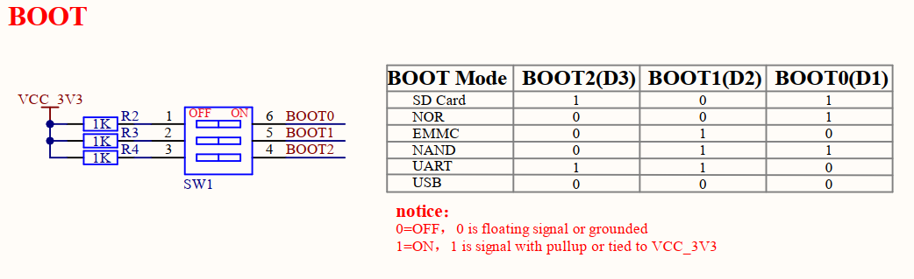
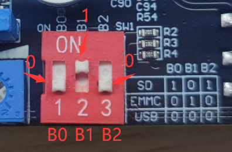
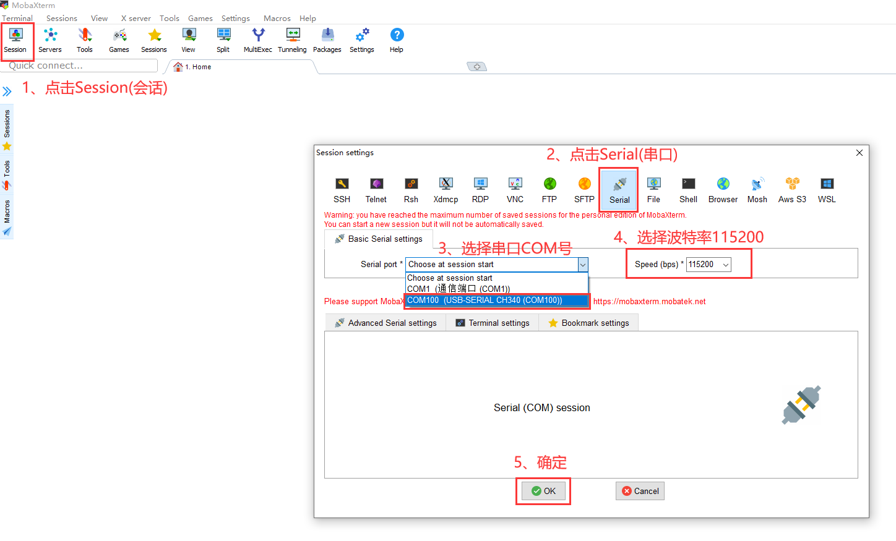
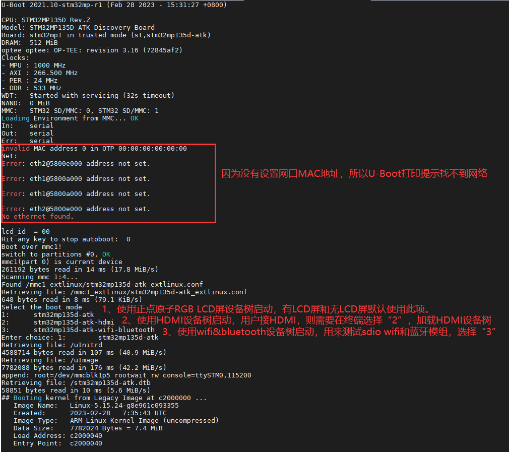
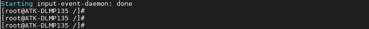

# 3.3 拨码开关设置及登录开发板

&emsp;&emsp;ATK-STM32MP135的拨码开关支持以下模式，下图是开发板底板BOOT原理图。

 
图3.3.1 BOOT启动模式

&emsp;&emsp;由开发板底板原理图可知 
&emsp;&emsp;（1）SD Card启动模式拨码为101； 
&emsp;&emsp;（2）EMMC启动模式拨码为010； 
&emsp;&emsp;（3）USB模式拨码为000。

&emsp;&emsp;ATK-DLMP135开发板使用一根USB Type-C连接线，连接底板上的USB_TTL接口，另一端连接到PC(电脑)的USB接口，出厂时已经把Linux系统烧写到核心板上的eMMC存储上了。所以我们将拨码拨至010，如下图，拨码向上表示为“1”（ON），向下表示为“0”(OFF)。

 
图3.3 2 eMMC启动拨码方式

&emsp;&emsp;开发板插上DC12V直流电源，MobaXterm选择为串口类型，按如下设置。请选择相应的COM口（COM口是PC（电脑）识别开发板USB_TTL的串口号）。

 
图3.3 3 MobaXterm串口设置

&emsp;&emsp;开发板从eMMC模式启动后，串口终端打印tf-a、Uboot和内核的启动信息，如下。

 
图3.3.4串口打印的U-Boot运行信息

&emsp;&emsp;出厂文件系统由buildroot构建而成，在登录开发板后，Qt界面还需要几秒后才能启动完成。 

&emsp;&emsp;默认不需要输入登录账户密码，直接进入到系统根目录。登录后串口终端如下图。

 
图3.3.5串口终端打印登录开发板的信息

&emsp;&emsp;注意：出厂文件系统默认支持SSH服务，当用户使用SSH登录时，需要输入账户为root，密码root。

