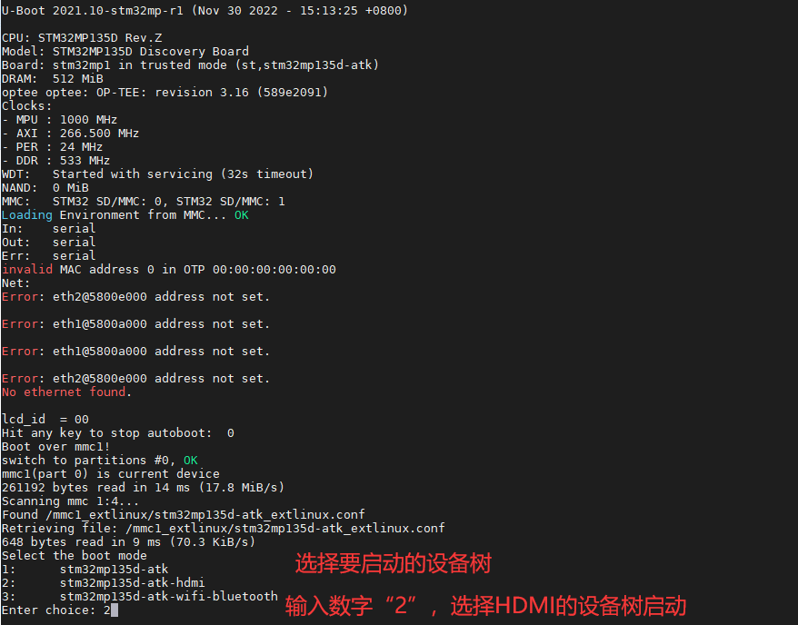
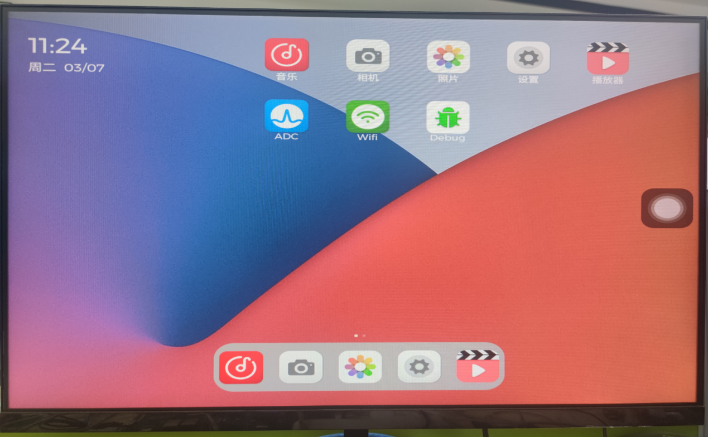
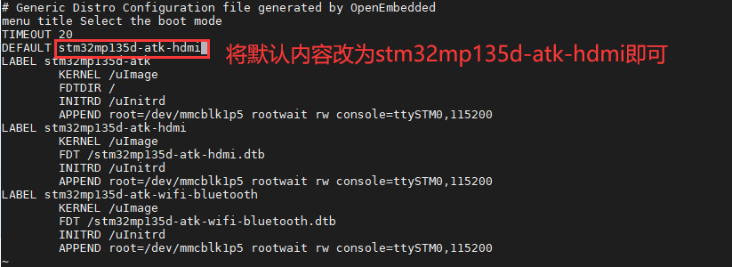

# 4.12 HDMI测试

&emsp;&emsp; - 板载HDMI最大支持分辨率简介

&emsp;&emsp;因为STMP32MP135 CPU没有HDMI控制器，所以只能用RGB转HDMI。ATK-DLMP135板载HDMI Sil902x芯片（充当一个HDMI发送器），Sil902x芯片支持1080p输出。但是STM32MP135 CPU 最大只能输出给LTDC 信号为WXGA (1366×768)@60fps。所以板载的HDMI只能由CPU的LTDC信号决定，也就是最大只能输出WXGA (1366×768) @60fps。

&emsp;&emsp;出厂系统默认配置的 HDMI 输出分辨率大小为1280×720@60fps。无需修改成 WXGA(1366×768) @60 fps，因为有些显示器可能不支持这个分辨率，可能会显示不了。经过实测，出厂系统使用Qt越大分辨率会不流畅，因为Qt界面分辨率大的比较耗性能。而正点原子RGB LCD屏在滑动界面时会感觉比较流畅，因为RGB LCD屏分辨率较小，要知道STM32MP135也只不过是单核A7而已，性能不能与手机相比。

&emsp;&emsp;由于HDMI信号是由RGB信号转过来的，所以HDMI与RGB LCD共用一个接口。所以理论上只能使用其中一种。

&emsp;&emsp;首先用HDMI连接线（用户手上需要有HDMI连接线，没有就需要用户自行购买），连接到开发板上的HDMI接口，另一端连接到显示器，显示器上电。开发板拨码从eMMC启动，在串口终端里看到U-Boot启动倒计时结束后，进入设备树加载模式，按下数字键“2”来选择使用HDMI的设备树，按Enter后就会加载HDMI设备树启动。


<center>
<br />
图4.12.1 HDMI设备树选择
</center>

&emsp;&emsp;启动成功后，可以在显示屏显示出厂系统的Qt UI，如下图。

<center>
<br />
图4.12.2 HDMI显示屏显示
</center>

&emsp;&emsp; - 永久修改加载HDMI设备树启动

&emsp;&emsp;出厂系统默认以LCD的stm32mp135d-atk.dtb设备树启动。从eMMC启动后，可在出厂文件系统的/lib/modules/mmc1_extlinux/stm32mp135d-atk_extlinux.conf文件里修改默认启动的设备树。若用户是使用TF（SD）系统卡启动系统，则应在出厂文件系统的/lib/modules/mmc0_extlinux/stm32mp135d-atk_extlinux.conf文件修改。

&emsp;&emsp;在串口终端输入以指令，编辑启动配置文件，将stm32mp135d-atk修改为stm32mp135d-atk-hdmi。按Esc再按:wq保存退出。这样以后开发板启动就会默认以HDMI设备树启动。用户不用在U-Boot选择设备树启动了。

```c#
vi /lib/modules/mmc1_extlinux/stm32mp135d-atk_extlinux.conf
```

<center>
<br />
图4.12.3修改默认加载HDMI设备树
</center>


