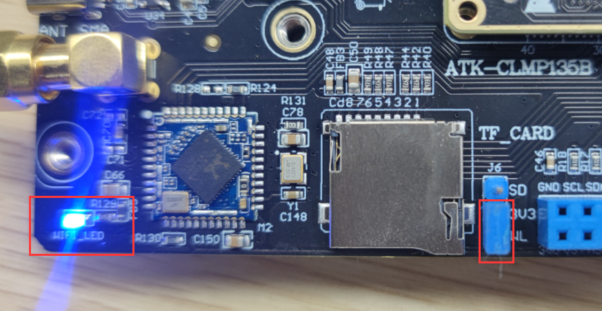
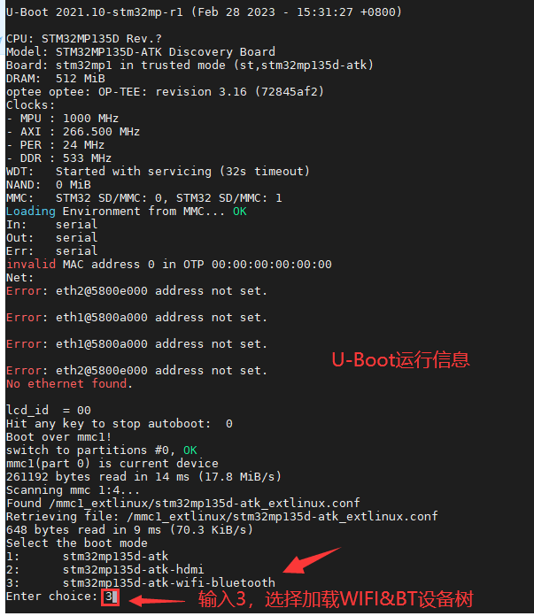
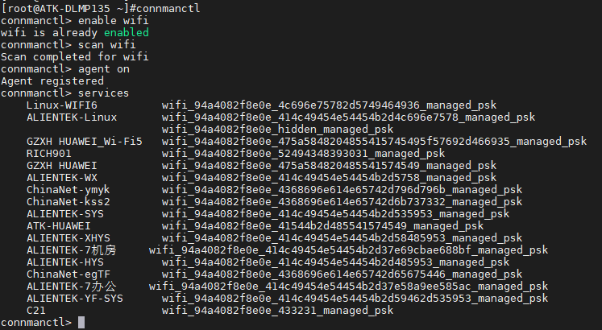
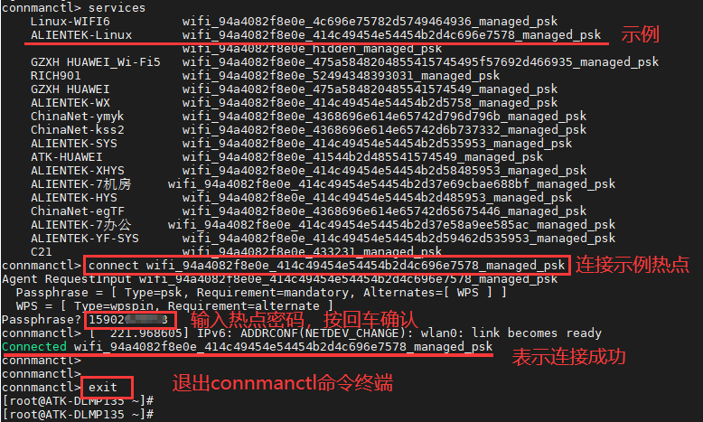
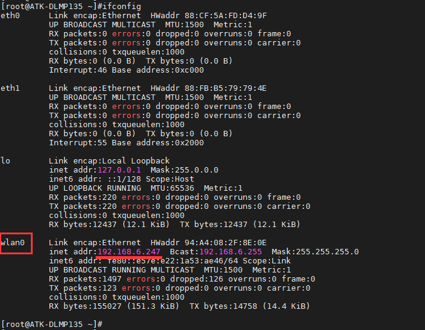
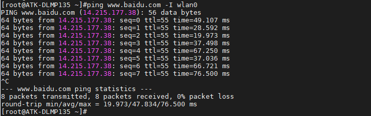

# 4.13 板载SDIO WIFI测试

&emsp;&emsp;ATK-DLMP135开发板采用WIFI&蓝牙二合一模组，芯片为RTL8723DS。

&emsp;&emsp;开始实验时，请检查板子上的天线，即USB接口旁边的天线是否拧好拧紧。需要插上12V电源。

&emsp;&emsp;另外由于SDIO WIFI和TF卡共用同一组SDMMC信号通信，故测试WIFI时需切换底板供电跳线帽，连接3V3与WL，以供电SDIO WIFI，此时WIFI_LED蓝色电源指示灯亮起。

<center>
<br />
图4.13.1 SDIO WIFI&BT模组供电连接示意图
</center>

&emsp;&emsp;除了进行供电切换，还需要加载对应的设备树。

&emsp;&emsp;开发板上电，在U-Boot运行时在设备树选择终端，输入数字“3”，即可加载SDIO WIFI&Bluetooth设备树。


<center>
<br />
图4.13.2 加载SDIO WIFI&BT模组设备树
</center>

&emsp;&emsp;进入文件系统后，输入下面命令进行WIFI测试。

```c#
rfkill unblock all         //解锁射频
connmanctl                 //进入 WIFI操作终端
connmanctl> enable wifi    //使能 WIFI
connmanctl> scan wifi      //开启 WIFI 扫描，可以多次扫描
connmanctl> agent on       //注册代理
connmanctl> services       //列出扫描到的 WIFI 列表
```

&emsp;&emsp;命令运行结果如下。

<center>
<br />
图4.13.3扫描到的热点
</center>

&emsp;&emsp;从扫描到的WIFI热点列表中，使用命令connect XXXX 进行连接，再输入密码按回车确认。比如示例要连接 ALIENTEK-Linux，运行结果如下：

<center>
<br />
图4.13.4连接热点
</center>

&emsp;&emsp;如上结果，已连接到WIFI热点，可以用ifconfig指令查看我们的wlan0所获取的ip地址。

<center>
<br />
图4.13.5查看获取到的ip地址
</center>

&emsp;&emsp;ping百度测试连通性，也可以ping网关来测试WIFI的连通性。注意，如果ping不通百度，请重启开发板，不要插网线，重新连接WIFI即可！因为系统会默认只让一个网络设备连通外网。

```c#
ping www.baidu.com -I wlan0
```

<center>
<br />
图4.13.6 ping百度测试
</center>


