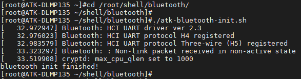
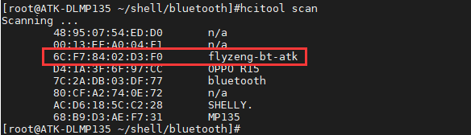

# 4.14 板载蓝牙测试

&emsp;&emsp;ATK-DLMP135开发板采用WIFI&蓝牙二合一模组，芯片为RTL8723DS。

&emsp;&emsp;和上章节测试SDIO WIFI一样，首先确保进行供电与设备树加载的切换。

&emsp;&emsp;为了防止蓝牙未完全复位，我们向内核申请一个 gpio（这个 gpio 硬件连接到蓝牙的上电使能管脚上），设置为输出方向，先给一个低电平，再给一个高电平，这样就可以给蓝牙复位了。

&emsp;&emsp;编 者 蓝 牙 初 始 化 脚 本 atk-bluetooth-init.sh，放在/root/shell/bluetooth下。我们可进入/root/shell/bluetooth目录，运行初始化脚本。

```c#
cd /root/shell/bluetooth/
./atk-bluetooth-init.sh
```

<center>
<br />
图4.14.1运行初始化脚本
</center>

&emsp;&emsp;使用下面指令开启蓝牙。

```c#
hciconfig hci0 up
hciconfig hci0 piscan //开启蓝牙被扫描
```

<center>
<br />
图4.14.2打开蓝牙
</center>

&emsp;&emsp;解释：<br />
&emsp;&emsp;（1）hciconfig：蓝牙工具，用于配置蓝牙<br />
&emsp;&emsp;（2）hci0：蓝牙网络节点名称<br />
&emsp;&emsp;（3）up：打开蓝牙，如果设置为down表示关闭蓝牙

&emsp;&emsp;使用下面指令扫描蓝牙设备，用户先打开手机蓝牙，再使用如下指令扫描。可以尝试多扫描几次。

```c#
hcitool scan
```

<center>
<br />
图4.14.3扫描到手机蓝牙设备
</center>

&emsp;&emsp;手机连接开发板蓝牙，系统里必须有蓝牙提供服务，而开发板默认文件系统里没有开启相应的服务。手机连接蓝牙的方式有很多种，例如蓝牙音频，蓝牙传输文件obex等服务，Buildroot文件系统默认没有对应服务配置。可使用蓝牙SPP协议与手机蓝牙进行串口数据传输。