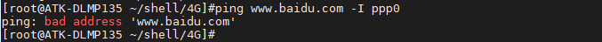

# 4.15 4G模块ME3630-W测试

&emsp;&emsp;ATK-DLMP135开发板预留一个4G模块接口，支持ME3630-W，EC20等4G模块的安装。准备ME3630-W 4G模块，正点原子店铺代理出售。将ME3630-W 4G模块插到4G模块接口处，拧上螺丝。保证4G模块与座子接口吻合连接。请使用原装天线，把天线连接到4G模块的MAIN接口处。（温馨提示：4G模块在开封使用后，金手指容易氧化，时间长了上面会有一层氧化膜，如果多次实验不成功，请检查4G模块是否插好，或者是否有氧化膜。使用后请保存好4G模块！）

&emsp;&emsp;正确插入4G卡（支持移动、联通、电信4G卡）及插好模块，开发板启动后底板上的WWAN LED 会亮绿灯。如果WWAN LED绿灯未亮起，请检查模块是否正确连接插入，4G卡是否插入，天线是否接好，需插上配带的12V电源。


<center>
<br />
图4.15.1 4G模块天线SIM卡连接图
</center>

&emsp;&emsp;4G模块正常加载后，可以在/dev/下看到有3个ttyUSB*生成。4G模块通过AT指令访问/dev/ttyUSB2进行通信。

```c#
ls /dev/ttyUSB*
```

<center>
<br />
图4.15.1.2查看生成的/dev/ttyUSB*节点
</center>

## 4.15.1 pppd拨号上网

&emsp;&emsp;出厂文件系统/root/shell/4G目录下已经存放有测试4G模块的相关脚本。

&emsp;&emsp;进入/root/shell/4G/目录下。

```c#
cd /root/shell/4G/
```

&emsp;&emsp;使用ls指令可以看到此路径下有多个脚本文件，如果没有这样的文件，请及时更新系统固件。


<center>
<br />
图4.15.1.3查看脚本
</center>

&emsp;&emsp;其中尾缀10000表示适用于电信卡，10010表示适用于联通卡，10086表示适用于移动卡。

&emsp;&emsp;这里以移动卡为例。执行下面ppp-on脚本，进行4G模块配置，&的作用是后台运行。

```c#
./ppp-on-10086 &
```

<center>
<br />
图4.15.1.4 ppp拨号上网获取到IP和DNS
</center>

&emsp;&emsp;按下Enter键返回命令行，使用ifconfig可查看4G模块的拨号节点名称。

<center>
<br />
图4.15.1.5 查看4G网络节点名称
</center>

&emsp;&emsp;ping百度测试连通性，-I是指定网卡，有数据回复表示连通。按Ctrl+c终止指令。

```c#
ping www.baidu.com -I ppp0
```

<center>
<br />
图4.15.1.6 ping百度测试4G网络连接
</center>

&emsp;&emsp;如果提示“bad address 'www.baidu.com”，那么请检查一下DNS服务器地址是否设置正确，打开/etc/resolv.conf 文件，然后加入上面获取到的DNS地址“221.179.38.7”即可。

```c#
echo nameserver 221.179.38.7 >> /etc/resolv.conf
```

<center>
<br />
图4.15.1.7缺少DNS
</center>

<center>
<br />
图4.15.1.8添加DNS到/etc/resolv.conf 文件
</center>


## 4.15.2 ECM上网

&emsp;&emsp;在操作系统看来，CDC ECM设备就是一个虚拟以太网卡，包含标准网卡需要的MAC地址和IP地址。

&emsp;&emsp;ECM_DEMO_AUTO和ECM_DEMO是高新兴ECM上网的程序（我们不需要知道源码，因为它只是一个工具），指令简介如下：

```c#
ECM_DEMO -t up                            //开启ecm上网 
ECM_DEMO -t down                          //关闭ecm上网
ECM_DEMO -t up -p /dev/ttyUSB1 -a 3gnet   //开启的同时指定对应的apn和拨号端口
ECM_DEMO -t down -p /dev/ttyUSB1          //关闭ecm上网
```

&emsp;&emsp;详细的参数可以执行ECM_DEMO -h查看。

&emsp;&emsp;ECM_DEMO_AUTO 和 ECM_DEMO参数是一样的，区别是ECM_DEMO执行完流程就会退出，ECM_DEMO_AUTO会一直运行并每隔一段时间会检查是否断网，断网了会自动重连。
ECM_DEMO_AUTO默认会自动执行拨号流程，故适合做开机自启的程序。

&emsp;&emsp;要配置ECM模式上网，如果运行了pppd上网，请先执行disconnect脚本断开pppd拨号上网，再执行下面的指令配置成ECM模式连接网络。

```c#
./disconnect
./ECM_DEMO -t up
```

<center>
<br />
图4.15.2.1先断开ppp-on上网，再执行ecm-on上网
</center>

&emsp;&emsp;使用ifconfig指令查看usb0获取的ip地址，如果没有获取到ip地址，请使用udhcpc -i usb0获取。

```c#
ifconfig
```

<center>
<br />
图4.15.2.2查看ip地址
</center>

&emsp;&emsp;ping百度测试连通性，-I是指定网卡，有数据回复表示连通。按Ctrl+c终止指令。

```c#
ping www.baidu.com -I usb0		// -I参数是指定网卡名usb0（4G网络）
```

<center>
<br />
图4.15.2.3 ping百度测试上网
</center>

&emsp;&emsp;如果需要检测4G是否在线（断线重连），建议使用./ECM_DEMO_AUTO &指令，放于后台运行。连上后如果没有获取到ip地址，请使用udhcpc -i usb0获取。

<center>
<br />
图4.15.2.4 ECM_DEMO_AUTO联网
</center>


