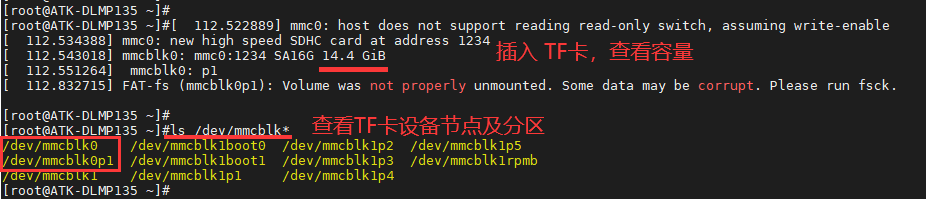
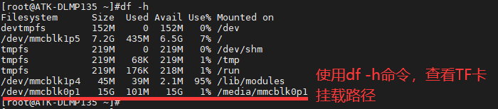
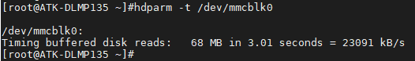
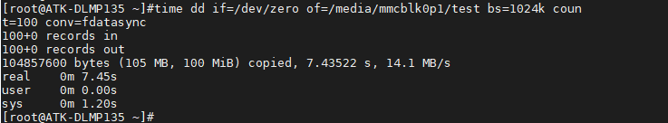

# 4.16 TF（SD）卡测试

&emsp;&emsp;指令提示：

&emsp;&emsp;time命令常用于测量一个命令的运行时间，dd 用于复制，从 if(input file)文件读出，写到 of(output file)指定的文件，bs 是每次写块的大小，count 是读写块的数量。"if=/dev/zero"不产生 IO，即可以不断输出数据，因此可以用来测试纯写速度。

&emsp;&emsp;开发板启动前，将TF卡插入到开发板TF卡卡槽处。需注意一点，由于开发板TF卡电路和SDIO WIFI电路共用同一组SDMMC1总线通信，而开发板采用供电切换方式来使用不同的功能。故测试TF卡时，需将TF卡和SDIO WIFI的供电跳线帽切换到供电TF卡处，排针接口标识为J6。另外测试TF卡时，U-Boot中不能选择加载wifi&bluetooth设备树，两者不能共用。

<center>
<br />
图4.16.1 TF卡供电连接示意图
</center>

&emsp;&emsp;作者是从eMMC启动，可以看到/dev/mmcblk0就是TF卡的设备节点，/dev/mmcblk0p1是TF卡的默认分区。注意需要使用FAT32格式的TF卡，不能使用NTFS格式。

<center>
<br />
图4.16.2 查看TF卡设备节点及分区
</center>

&emsp;&emsp;使用df -h命令，查看TF卡挂载路径，下图可看出TF卡挂载目录为/media/mmcblk0p1。

```c#
df -h
```

<center>
<br />
图4.16.3 将TF卡分区挂载到/mnt目录
</center>

## 4.16.1 读速度测试

&emsp;&emsp;常用于测试硬盘读取速度的指令有hdparm与dd，此处只演示hdparm读TF卡的速度。（读写速度与所用的TF卡类型有关）

```c#
hdparm -t /dev/mmcblk0
```

<center>
<br />
图4.16.1.1读速度测试
</center>

## 4.16.2 写速度测试

&emsp;&emsp;使用dd指令写100MB数据到TF卡的挂载目录，即/media/mmcblk0p1。写入数据越大，越接近实际值。

```c#
time dd if=/dev/zero of=/media/mmcblk0p1/test bs=1024k count=100 conv=fdatasync
```

<center>
<br />
图4.16.2.1 写速度测试
</center>


&emsp;&emsp;测试完成后，可删除挂载目录/media/mmcblk0p1下的“test”测试文件，完成TF卡的写速度测试。

