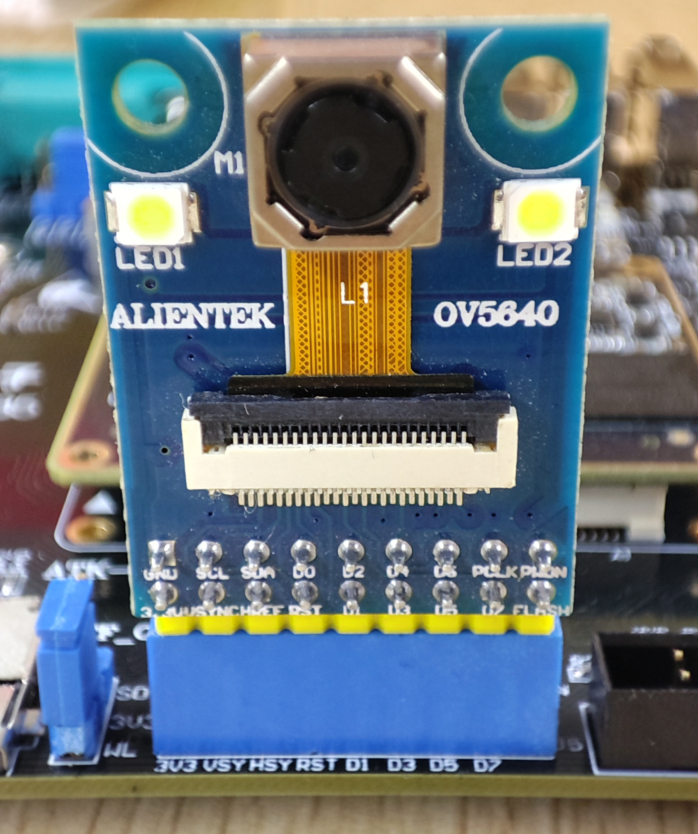
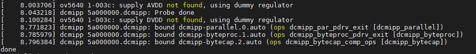
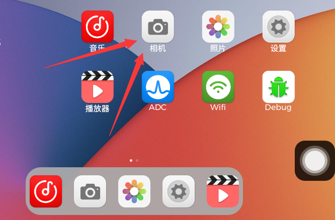

# 4.17 OV5640摄像头

&emsp;&emsp; - OV5640摄像头测试

&emsp;&emsp;实验前请准备ov5640摄像头模块（500万像素），本公司的任何分辨率的RCB LCD电容屏。

&emsp;&emsp;摄像头插法：<br />
&emsp;&emsp;摄像头镜头往开发板外侧，直接插到J5接插口处，即CAMERA接口。由于没有防反插设计，插摄像头时需要注意看底板丝印，按引脚编号对应插上，即镜头朝向板子外侧。


<center>
<br />
图4.17.1摄像头实物连接
</center>

&emsp;&emsp;开机前先插上摄像头和LCD屏幕（不支持热插拨），接好设备后再启动开发板。

<center>
<br />
图4.17.2启动时ov5640驱动打印的信息
</center>

&emsp;&emsp;查看ov5640生成的节点，确认节点是video0。

```c#
ls /dev/video0
```

<center>
<br />
图4.17.3 ov5640节点
</center>

&emsp;&emsp;打开QT界面的“相机”应用，即可打开OV5640摄像头，进行图像采集。如下图所示。

<center>
<br />
图4.17.4 QT界面“相机”应用
</center>


