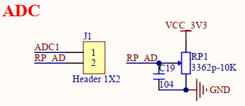
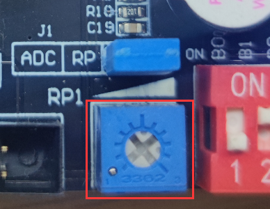
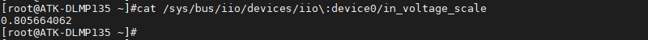

# 4.18 ADC测试

&emsp;&emsp;注意：ADC的采集电压绝对值最大是3.3V，请不要超过 3.3V，否则可能对芯片造成损坏。

&emsp;&emsp;ATK-DLMP135底板上J1处留有一路ADC方便用户测试。底板原理图如下。


<center>
<br />
图4.18.1 ADC底板原理图
</center>

&emsp;&emsp;下图为ATK-DLMP135开发板的ADC位置。

<center>
<br />
图4.18.2开发板ADC位置
</center>

&emsp;&emsp;ADC的主要特性：<br />
&emsp;&emsp;STM32MP135D支持ADC功能，提供两个ADC控制器，采样精度可配置为12, 10和8。

&emsp;&emsp;在Linux系统中，ADC采样属于IIO子系统下，可以通过sysfs提供的接口来访问ADC控制器，使用的是12位精度。

&emsp;&emsp;使用下面的指令来获取ADC1采样的数据，这里读出里出来的值是原始值raw_value。

```c#
cat /sys/bus/iio/devices/iio\:device0/in_voltage0_raw
```

<center>
<br />
图4.18.3查看raw的值
</center>

&emsp;&emsp;需要使用下面的计算公式来转换成实际值

```c#
real_value = (raw_value + offset_value) * scale
```

&emsp;&emsp;其中offset的值可以通过下面的指令获取

```c#
cat /sys/bus/iio/devices/iio\:device0/in_voltage_offset
```

<center>
<br />
图4.18.4查看offset的值
</center>

&emsp;&emsp;其中scale的值可以通过下面的指令获取，此值跟参考电压有关。

```c#
cat /sys/bus/iio/devices/iio\:device0/in_voltage_scale
```

<center>
<br />
图4.18.5查看scale值
</center>

