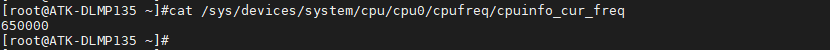
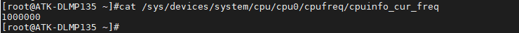

# 4.20 CPU主频

&emsp;&emsp;正点原子ATK-DLMP135开发板处理器最高支持1GHz主频，但出厂系统内核配置CPU调频模式为“ondemand”模式，此模式会定期检查负载情况，根据负载轻重情况来自动调节频率。系统在轻负载下会运行在650MHz主频，重负载会运行在1GHz主频（比如播放视频等）。

&emsp;&emsp;在默认出厂系统轻负载情况下，大部分时间CPU会工作在650MHz主频，全时间段内CPU可能工作在650MHz或1GHz之间。

&emsp;&emsp;输入下面指令，查看出厂系统 CPU 默认主频。

```c#
cat /sys/devices/system/cpu/cpu0/cpufreq/cpuinfo_cur_freq
```

<center>
<br />
图4.20.1查看CPU当前主频
</center>

&emsp;&emsp;输入下面指令，查看可用主频，该处理器默认提供650MHz和1000MHz两种主频可用。

```c#
cat /sys/devices/system/cpu/cpu0/cpufreq/scaling_available_frequencies
```

<center>
<br />
图4.20.2查看CPU可用主频
</center>

&emsp;&emsp;那么是否可以无需重新编译 Linux 源码来修改 CPU 的主频呢，答案是可以的！

&emsp;&emsp;输入下面的指令，申请用户空间控制 CPU 主频。

```c#
echo userspace > /sys/devices/system/cpu/cpu0/cpufreq/scaling_governor
```

&emsp;&emsp;输入下面指令，将 CPU 主频修改为 1000MHz，即1GHz，注意不是任意主频都支持，必须是上面支持的可用频率！

```c#
echo 1000000 > /sys/devices/system/cpu/cpu0/cpufreq/scaling_setspeed
```

&emsp;&emsp;再查看当前的 CPU 主频。

```c#
cat /sys/devices/system/cpu/cpu0/cpufreq/cpuinfo_cur_freq
```

<center>
<br />
图4.20.3查看CPU当前主频
</center>


