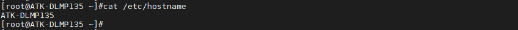
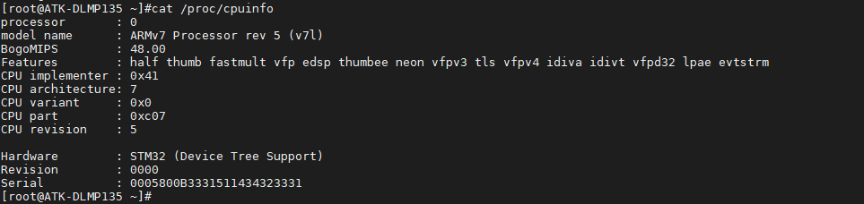
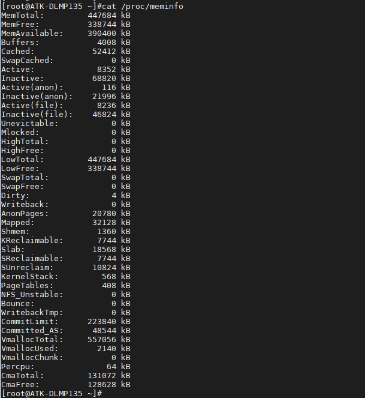

# 4.21 查看系统信息

## 4.21.1 查看系统主机名

```c#
cat /etc/hostname
```

<center>
<br />
图4.21.1.1查看系统主机名
</center>

## 4.21.2 查看CPU相关信息

```c#
cat /proc/cpuinfo
```

<center>
<br />
图4.21.2.1查看CPU相关信息
</center>


&emsp;&emsp;图中BogoMIPS值是48，是基于CPU主频为1GHz时的值。当CPU主频为650MHz时，BogoMIPS值为31.2。

## 4.21.3 查看内存相关信息

```c#
cat /proc/meminfo
```

<center>
<br />
图4.21.3.1查看内存相关信息
</center>

&emsp;&emsp;图中内存相关信息，以用户实际系统版本为准。


