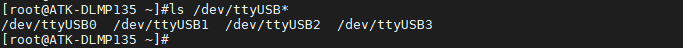
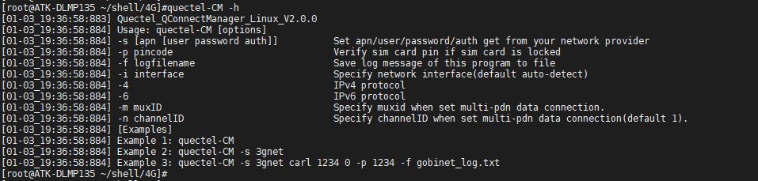
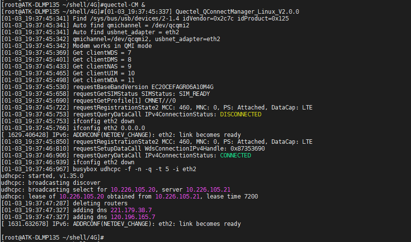
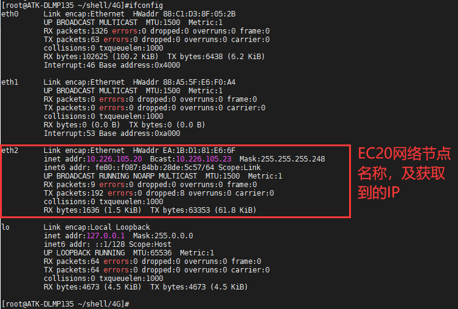
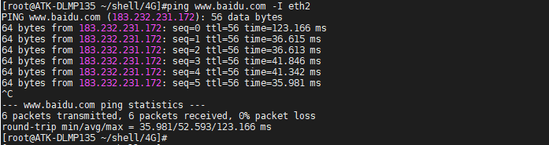

# 4.24 4G模块EC20测试


&emsp;&emsp;正点原子ATK-DLMP135底板上预留4G模块接口，ME3630-W，EC20等4G模块的安装。准备EC20模块，请自行在网上购买，注意购买时需要买天线，单单模块是不能正常工作的！（备注：EC20有许多类型模块，目前测试过的是EC20-CE模块，其中EC20-CE系列又有多种模块，不同的模块功能不一样，比如支持的运营商不一样，详细请咨询卖家），其他EC20系列请自行测试，理论上驱动一样，有需求找移远技术支持。）。将EC20 4G模块插到4G模块接口处，拧上螺丝。保证4G模块与座子接口吻合连接。请使用原装天线，把天线连接到4G模块的MAIN接口处。

&emsp;&emsp;正确插入4G卡（支持的运营商，请咨询对应模块的卖家，注意有些可能模块不支持物联网卡，请使用普通4G卡测试）及插好模块，开发板启动后底板上的WWAN LED 会亮绿灯。如果WWAN LED绿灯未亮起，请检查模块是否正确连接插入，4G卡是否插入，天线是否接好，开发板是必须插上配带的12V电源。

&emsp;&emsp;4G模块正常加载后，可以在/dev/下看到有4个ttyUSB*生成。4G模块通过AT指令访问/dev/ttyUSB2进行通信。

```c#
ls /dev/ttyUSB*
```

<center>
<br />
图4.24.1查看4G模块的接口
</center>

## 4.24.1 使用quectel-CM

&emsp;&emsp;使用 quectel-CM 拨号程序工具（这个工具是我们预先交叉编译好放进文件系统/usr/sbin 目录下面的），方便用户使用。

&emsp;&emsp;输入quectel-CM -h查看用法。

```c#
quectel-CM -h
```

<center>
<br />
图4.24.1.1查看quectel-CM工具说明
</center>

&emsp;&emsp;可以看到-s参数是指定apn类型，移动卡apn一般是cmnet，联通卡apn一般是3gnet，电信卡一般是ctnet。备注：APN指一种网络接入技术，通常是通过手机上网时必须配置的一个参数，它决定了手机通过哪种接入方式来访问网络。

```c#
quectel-CM &			// 如果不清楚，直接输入quectel-CM，&的作用是后台运行。
```

<center>
<br />
图4.24.1.2通过quectel-CM工具上网
</center>

&emsp;&emsp;按Enter回到命令行，输入ifconfig命令，查看EC20 4G模块的网络节点名称。eth0和eth1是板子的2个以太网网口节点名称，那么eth2就是EC20 4G模块的网络节点名称了。

<center>
<br />
图4.24.1.3获取到的IP
</center>


&emsp;&emsp;ping百度测试连通性，-I是指定网卡，有数据回复表示连通。

```c#
ping www.baidu.com -I eth2
```

<center>
<br />
图4.24.1.4 ping百度测试
</center>

