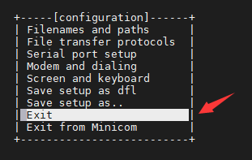

# 4.4 串口测试

## 4.4.1 RS232串口测试

&emsp;&emsp;ATK-DLMP135开发板板载一路RS232和RS485，由于它们共用同一个USART2串口，故需要调整开发板的跳线帽，来确保选择RS232功能。另外测试前需要准备一根USB转RS232公头串口线，不同品牌均可。

 
图4.4.1.1 USB转RS232串口线（公头）

&emsp;&emsp;将USB转RS232串口线接入到RS232接口，再把J2排针组的U2_TX和COM_RX，U2_RX和COM_TX通过跳线帽连接在一起，即将USART2串口连通RS232功能。如图4.4.1.2。

 
图4.4.1.2 RS232跳线帽连接示意图

&emsp;&emsp;在计算机的设备管理器查看端口号。编者的端口号有两个，一个是开发板 USB 调试串口的，另一个就是RS232的端口号了。

 
图4.4.1.3设备管理器查看端口号

&emsp;&emsp;可以看到COM43为编者的调试串口（UART4），COM7为开发板底板的 RS232(USART2)串口。下面使用minicom串口调试工具来进行数据收发测试。

&emsp;&emsp;执行下面命令进入minicom配置界面（这里不详细讲minicom使用方法）

 
图4.4.1.4进入minicom配置界面

&emsp;&emsp;进入minicom配置界面，通过键盘“↓”方向键选择第3项“Serial port setup”来配置RS232串口。

 
图4.4.1.5 minicom配置界面

&emsp;&emsp;在出厂系统中，USART2串口对应的设备为/dev/ttySTM1，所以我们下面配置为/dev/ttySTM1，115200，8N1，无硬件流控。

&emsp;&emsp;操作方式为，在下面界面按“A”键即可修改“Serial Device”选项内容，我们改为“/dev/ttySTM1”，按Enter确认；再按“F”键即可关闭硬件流控功能，即将默认的“Yes”改为“No”。按“E”键可调整波特率，但它默认为“115200 8N1”，所以我们不用调整。

 
图4.4.1.6串口配置界面

&emsp;&emsp;最后按Enter确认最终配置，即退出当前配置界面。以下界面选择“Exit”退出配置界面，即可进入数据收发窗口。

 
图4.4.1.7退出配置界面

 
图4.4.1.8进入数据收发窗口

&emsp;&emsp;在进行数据收发之前，先打开minicom数据回显功能，显示将要发送的数据和接收的数据。按Ctrl+A，再按“Z”即可打开minicom命令界面，按“E”键打开回显功能，返回数据收发窗口，即可通过RS232串口和PC电脑端口进行数据收发。

 
图4.4.1.9 按“E”打开回显功能

&emsp;&emsp;电脑打开COM7串口，波特率115200，8N1，即可通过RS232串口和开发板进行数据收发。

 
图4.4.1.10串口数据收发

&emsp;&emsp;测试完成后，按Ctrl+A，再按“Z”打开minicom命令界面，按“X”键退出minicom工具，按Enter键确认退出，完成测试过程。

 
图4.4.1.11退出minicom工具

## 4.4.2 RS485串口测试

&emsp;&emsp;在4.4.1小节我们知道，RS232与RS485可以通过跳线帽进行切换。在测试RS485前，我们先切换跳线帽连接RS485到USART2。另外我们需要借助正点原子USB转换器模块来完成测试，如果用户有其他RS485相关测试工具可以自行测试，不一定要用这个模块。如下图。

 
图4.4.2.1正点原子多合一USB转换器模块

&emsp;&emsp;下面将开发板J2排针组的U2_TX和485_RX，U2_RX和485_TX分别通过跳线帽连接到一起，即将USART2连通RS485功能。如图4.4.2.2。

 
图4.4.2.2 RS485跳线帽连接示意图

&emsp;&emsp;同时，将开发板的RS485 A端通过杜邦线连接到正点原子USB转换器模块的RS485 A端，B端连接到B端。使用了正点原子的USB转换器模块，会在PC(电脑端)看到一个串口。测试方法按4.4.1小节步骤来测试即可。

