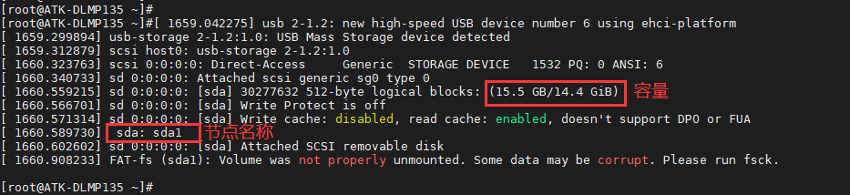
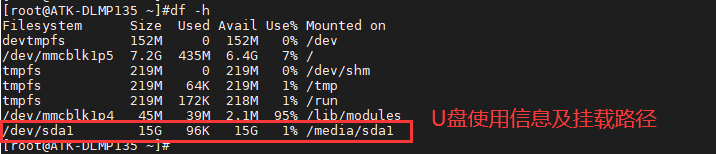
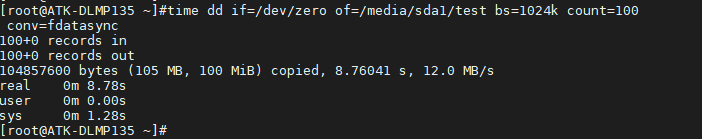
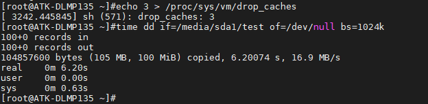

# 4.5 USB测试

## 4.5.1 USB HOST测试

&emsp;&emsp;将一个FAT32格式的U盘或者带TF卡的读卡器，直接插入到ATK-DLMP135开发板的USB_HOST1或USB_ HOST 2、USB_ HOST 3的USB接口上，出厂系统会弹出下面识别信息。

<center>
<br />
图4.5.1.1 U盘识别信息
</center>

&emsp;&emsp;输入 df -h 命令，查看 U 盘当前挂载路径。

```c#
df -h
```

<center>
<br />
图4.5.1.2 查看U盘挂载路径
</center>

&emsp;&emsp;上图可看出，当前U盘挂载路径为/media/sda1，下面进行U盘读写速度测试。

&emsp;&emsp;提示，读卡器本身的接口读写速度及TF卡种类、U盘种类等也会影响速度值快慢，用户测试值可能与编者测试值不同，速度值仅供参考。

&emsp;&emsp;写速度测试：

&emsp;&emsp;输入下面命令，向U盘写入测试文件：

```c#
time dd if=/dev/zero of=/media/sda1/test bs=1024k count=100 conv=fdatasync
```

<center>
<br />
图4.5.1 3 写速度评测
</center>

&emsp;&emsp;上面表示写入一个100MiB的test文件，写入速度为12MB/s。实际上写入的文件越大，求平均写入速度越接近实际值。拔出U盘之前执行一遍sync命令，同步到存储磁盘。

&emsp;&emsp;读速度测试：

&emsp;&emsp;输入下面指令,清理运行缓存。

```c#
echo 3 > /proc/sys/vm/drop_caches
```

&emsp;&emsp;小提示：因为 LINUX 的内核机制，一般情况下不需要特意去释放已使用的 cache。这些 cache 内容可以增加文件的读写速度。这里为了测试读写速度，故需执行释放。

&emsp;&emsp;输入下面指令,读取前面用dd指令写入的test文件。

```c#
time dd if=/media/sda1/test of=/dev/null bs=1024k
```

<center>
<br />
图4.5.1.4读取速度测试
</center>

&emsp;&emsp;这里表示读取100MiB数据，读取速度为16.9MB/s。读卡器的读写速度等也会影响此速度值，仅供参考。

## 4.5.2 USB鼠标测试

&emsp;&emsp;在出厂系统启动后，插上USB鼠标，LCD屏幕或连接HDMI到显示屏后，屏上会显示鼠标指针，即可用鼠标操作Qt界面。
