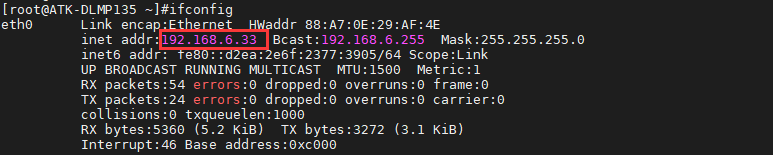
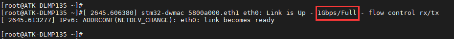

# 4.6 网络测试

&emsp;&emsp;ATK-DLMP135开发板板载2路千兆以太网，自适应10/100/1000M速率。

&emsp;&emsp;首先将网线插入到任一网口处，确保网线能上网，开发板出厂系统将根据本地网络环境自动获取到上网IP地址（出厂系统支持DHCP），输入ifconfig命令查看获取到的网络IP。

&emsp;&emsp;下面举例接入网口ENET1，对应网络节点eth0。而网口ENET2，对应网络节点eth1，测试方法同理。


```c#
ifconfig
```

<center>
<br />
图4.6.1 eth0获取外网ip地址
</center>

&emsp;&emsp;检查网络能否上网，如果有数据回复，则说明网络功能正常。按Ctrl+c终止指令。

```c#
ping www.baidu.com
```

<center>
<br />
图4.6 2 ping百度
</center>

&emsp;&emsp;如果本地网络非上网环境（局域网），则通过配置静态IP方式来测试网络通信。例如开发板配置网口ENET1网络静态IP：ifconfig eth0 192.168.1.100。PC（电脑端）配置静态IP：192.168.1.200。两者进行局域网ping通信测试。注意PC（电脑端）需关闭防火墙即可。

&emsp;&emsp;测试是否为千兆网络，注意要使用千兆网线、千兆路由器或者千兆交换机，PC（电脑端）网卡必须是千兆网卡，否则测试出来的速度或识别出来的速度可能是百兆。

&emsp;&emsp;如下图，当系统识别为1Gbps/Full则代表是千兆网络。

<center>
<br />
图4.6 3 识别为千兆网络
</center>

&emsp;&emsp;可使用iperf3指令测试千兆网络的连接速度，测试前请确保开发板网络能够正常ping通ubuntu。

&emsp;&emsp;在ubuntu系统环境下执行如下指令，设置ubuntu为服务器；

```c#
iperf3 -s
```

&emsp;&emsp;在ATK-DLMP135开发板命令行，通过iperf3指令，输入服务器IP即可。

&emsp;&emsp;注意，服务器IP需根据用户ubuntu的实际IP来设置，并非统一IP；

```c#
iperf3 -c 192.168.1.10 -i 10
```

&emsp;&emsp;解释：<br />
&emsp;&emsp;（1）-c：客户端。<br />
&emsp;&emsp;（2）192.168.1.10：用户ubuntu的ip地址，此处仅为示例。<br />
&emsp;&emsp;（3）-i：触发周期。

&emsp;&emsp;测试出来的 Bitrate 大概为 800 Mbits/sec 左右才是千兆网络速度(测试前请不要开启其他应用，以免影响测试速度)。


