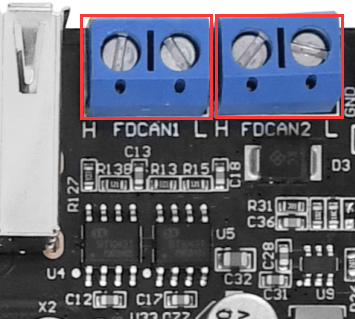
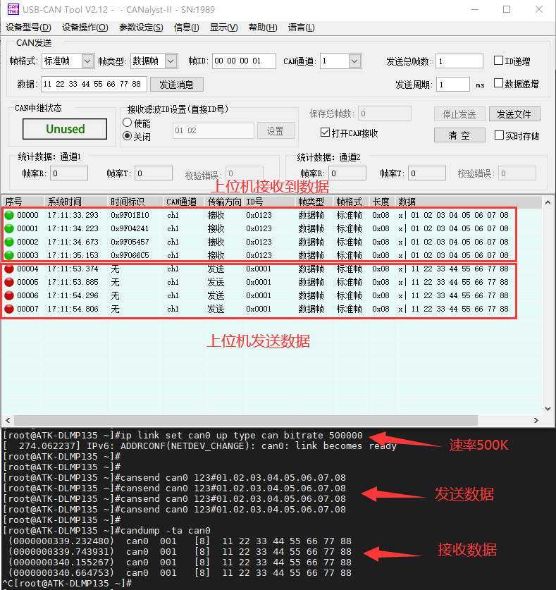
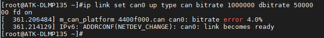
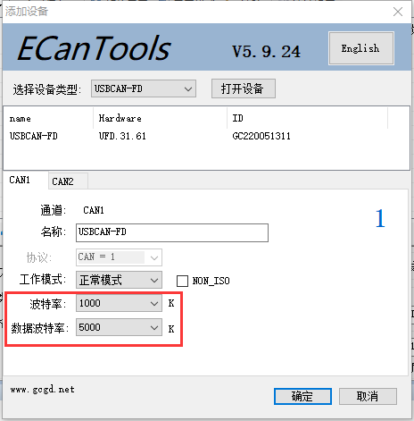
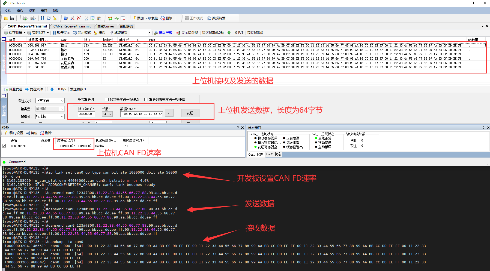

# 4.7 CAN

&emsp;&emsp;ATK-DLMP135开发板板载2路CAN（均支持CAN FD）。在测试CAN之前，需要准备好测试CAN的仪器，比如周立功的CAN分析仪、创芯科技的CAN分析仪和广成科技的CAN分析仪等，否则只能用两块不同开发板的CAN或者其他CAN设备测试。关于CAN仪器及CAN上位机的使用，请参照各厂商产品的使用说明书。

&emsp;&emsp;开发板所使用的CAN的主要特性如下：<br />
&emsp;&emsp; - 支持CAN FD，可以理解成CAN协议的升级版，只升级了协议，物理层未改变。<br />
&emsp;&emsp; - CAN与CAN FD主要区别：传输速率不同、数据长度不同、帧格式不同、ID长度不同。<br />
&emsp;&emsp; - 数据比特率最高5Mbps。

&emsp;&emsp;测试前请将CAN分析仪或者测试CAN的设备连接到ATK-DLMP135开发板的CAN接口，CANH端连接CAN仪器的CANH，CANL端连接CAN仪器的CANL。

&emsp;&emsp;下面举例使用FDCAN1接口来进行CAN功能测试，FDCAN2同理。开发板CAN接口如下图所示。


<center>
<br />
图4.7 1 CAN接口位置
</center>

## 4.7.1 CAN测试

&emsp;&emsp;CAN最低数据比特率10kBit/s，最高数据比特率1000kBit/s。

&emsp;&emsp;测试前提示一下，下面示例指令，是基于FDCAN1接口测试，对应系统设备名称为can0。若用户需要测试FDCAN2接口，则对应系统设备名称为can1，注意修改指令即可。

&emsp;&emsp;示例FDCAN1接口，配置can0数据比特率为500kBit/s。

```c#
ip link set can0 up type can bitrate 500000
```

&emsp;&emsp;使用cansend指令发送数据。

```c#
cansend can0 123#01.02.03.04.05.06.07.08
```

&emsp;&emsp;解释：<br />
&emsp;&emsp;（1）can0：can0表示FDCAN1接口设备，can1表示FDCAN2接口设备。<br />
&emsp;&emsp;（2）123：帧ID<br />
&emsp;&emsp;（3）01.02.03.04.05.06.07.08：帧数据

&emsp;&emsp;使用candump指令接收数据。按Ctrl+c终止指令。

```c#
candump -ta can0
```

&emsp;&emsp;解释：<br />
&emsp;&emsp;（1）-ta: t代表打印时间，a代表开启ASCII输出。

&emsp;&emsp;下面使用创芯科技CAN分析仪，设置CAN的速率为500000，测试结果如下图。


<center>
<br />
图4.7.1.1使用上位机与开发板进行CAN收发通信
</center>

## 4.7.2 CAN FD测试

&emsp;&emsp;下面采用广成科技的CAN测试设备（支持CAN FD），进行CAN FD测试。如果CAN测试设备不支持CAN FD功能，则不能用于测试CAN FD。

&emsp;&emsp;开发板的CAN FD波特率最高为1000 kBit/s，数据波特率为5000 kBit/s。可用的速率如下，如需要使用更低的波特率，请使用CAN，而非CAN FD。

&emsp;&emsp;测试前提示一下，下面示例指令，是基于FDCAN1接口测试，对应系统设备名称为can0。若用户需要测试FDCAN2接口，则对应系统设备名称为can1，注意修改指令即可。

&emsp;&emsp;设置不同速率时，需要先关闭CAN设备，再设置CAN的速率，如果设置不成功，请重启板子或者上位机软件。

```c#
ifconfig can0 down
```

&emsp;&emsp;这里提供配置CAN FD的速率示例，只需要选择下面其中一条指令来配置即可。

```c#
ip link set can0 up type can bitrate 1000000 dbitrate 5000000 fd on
ip link set can0 up type can bitrate 200000 dbitrate 1000000 fd on
ip link set can0 up type can bitrate 100000 dbitrate 500000 fd on
```

&emsp;&emsp;此处设置波特率为1000 kBit/s，数据波特率为5000 kBit/s进行测试。

```c#
ip link set can0 up type can bitrate 1000000 dbitrate 5000000 fd on
```

<center>
<br />
图4.7.2.1开发板设置CAN FD速率
</center>

<center>
<br />
图4.7.2.2广成科技CAN FD测试仪器上位机配置
</center>

&emsp;&emsp;使用cansend命令发送数据，下面为一行指令，请分行复制！

```c#
cansend can0 123##300.11.22.33.44.55.66.77.88.99.aa.bb.cc.dd.ee.ff.00.11.22.33.44.55.66.77.88.99.aa.bb.cc.dd.ee.ff.00.11.22.33.44.55.66.77.88.99.aa.bb.cc.dd.ee.ff.00.11.22.33.44.55.66.77.88.99.aa.bb.cc.dd.ee.ff
```

&emsp;&emsp;解释：<br />
&emsp;&emsp;（1）can0: can0表示FDCAN1接口设备，can1表示FDCAN2接口设备。<br />
&emsp;&emsp;（2）123: 帧ID<br />
&emsp;&emsp;（3）3：标志（flags）<br />
&emsp;&emsp;（4）00.11.22…: 帧数据

&emsp;&emsp;使用candump指令接收数据。按Ctrl+c终止指令。

```c#
candump -ta can0
```

&emsp;&emsp;解释：<br />
&emsp;&emsp;（1）-ta: t代表打印时间，a代表开启ASCII输出

&emsp;&emsp;开发板CAN FD测试结果如下图。


<center>
<br />
图4.7.2.3使用上位机与开发板进行CAN FD收发通信
</center>


