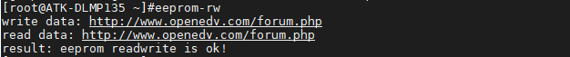

# 4.9 EEPROM测试

&emsp;&emsp;ATK-DLMP135开发板板载EEPROM芯片，型号为AT24C64，它通过I2C总线进行读写访问，具备8KB存储空间。

&emsp;&emsp;出厂系统提供一个简单读写测试工具eeprom-rw来进行AT24C64的读写测试，执行以下指令即可。

```c#
eeprom-rw
```

&emsp;&emsp;返回如下信息，表示读写正常。


<center>
<br />
图4.9.1 EEPROM读写测试
</center>


