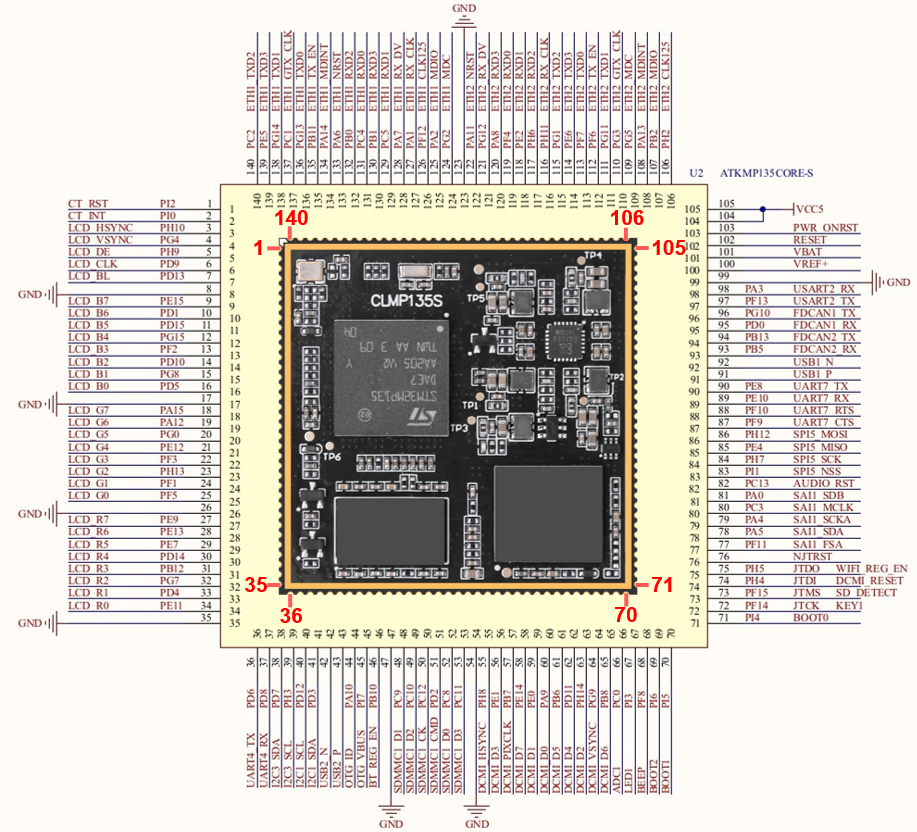

# 3.2 邮票孔接口核心板CLMP135S

## 3.2.1 硬件参数

|    **项目**    |        **参数**         |      **备注**      |
| :------------: | :---------------------: | :----------------: |
| 核心板尺寸规格 |        44mm*44mm        |                    |
|   处理器型号   |     STM32MP135DAE7      |    LFBGA289封装    |
|   处理器架构   | 单核Cortex-A7，主频1GHz |                    |
|    电源管理    |        分立电源         |                    |
|      内存      |       512MB DDR3L       | 型号以实际贴片为准 |
|      存储      |        8GB EMMC         | 型号以实际贴片为准 |
|    工作电压    |         5V 0.5A         | 供电范围：5V±300mV |
|      功耗      |         小于1W          | 核心板最小系统功耗 |
|    工作温度    |   商业级：-20℃ ~ +70℃   |                    |
|    工作温度    |   工业级：-40℃ ~ +80℃   |                    |
|   接口管脚数   |         140PIN          |                    |
|    管脚间距    |          1.2mm          |                    |
|    接口形式    |         邮票孔          |                    |
|    PCB工艺     |   8层，独立接地信号层   |                    |

## 3.2.2 核心板资源

 
图 3.2.1 ATK- CLMP135S核心板资源

## 3.2.3 管脚顺序及接口信号

 
图 3.2.2 ATK-CLMP135S核心板接口信号

&emsp;&emsp;图中核心板左上角有白色标记点作为参照点，屏蔽罩圆点置于左上角，从参照点往下为1号管脚。

 
图 3.2.3 ATK-CLMP135S核心板背面图

## 3.2.4 管脚可复用功能资源

&emsp;&emsp;核心板引出了处理器上的所有IO，用户可以根据自己需要，自行设计底板来运用核心板上IO资源，将IO复用成自己所需要的功能。

&emsp;&emsp;根据外设功能，此处列举ATK-CLMP135系列核心板可复用的单项外设最大资源数，具体选型可以结合芯片数据手册。（单项外设最大资源数：指的是在不使用其他外设的前提下，核心板所能使用的某项外设的最大数量）

| **外设功能**   | **单项外设最大复用数** | **外设功能**     | **单项外设最大复用数** |
| :------------: | :--------------------: | :--------------: | :--------------------: |
| GPIO           | 121个                  | Ethernet         | 2个，支持千兆          |
| ADC            | 2个，20通道            | SD/MMC           | 1个                    |
| PWM            | 37个                   | RGB LCD          | 1个                    |
| U(S)ART        | 4个USART+4个UART       | Camera DCMI      | 1个                    |
| I2C            | 5个                    | USB              | 2个                    |
| SPI            | 5个                    | SAI              | 2个                    |
| CAN FD         | 2个                    | JTAG             | 1个                    |
| 32位定时器     | 2个                    | 16位高级定时器   | 2个                    |
| 16位通用定时器 | 10个                   | 16位低功耗定时器 | 5个                    |
| 系统定时器     | 4个                    | RTC              | 1个                    |
| WDOG           | 2个                    |                  |                        |

