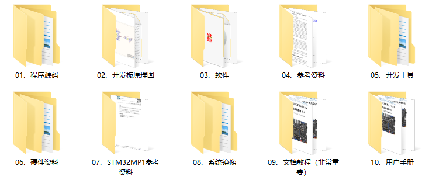

&emsp;&emsp;核心板资料和开发板资料在同一份网盘里，ATK-CLMP135核心板和ATK-DLMP135开发板的资料是通用的。也就是说，正点原子MP135相关产品共用一份网盘资料。

&emsp;&emsp;正点原子为ATK-DLMP135开发板提供了丰富的开发文档和软件资源，涉及Linux驱动开发、Qt GUI开发和C应用开发等领域，所有软件资源通过百度网盘形式全部免费开放下载。

&emsp;&emsp;开发板&核心板资料链接： 
&emsp;&emsp;下载中心：http://www.openedv.com/docs/boards/arm-linux/zdyz-STM32MP135.html

# 7.1 资料说明

&emsp;&emsp;网盘资料一级目录：

 
图 7.1.1 网盘资料一级目录

&emsp;&emsp;资料目录说明：

| **目录**                 | **说明**                                                 |
| :----------------------: | :------------------------------------------------------- |
| 01、程序源码             | 源码合集，包含出厂系统源码、教程例程源码等               |
| 02、开发板原理图         | 原理图合集，包含开发板、核心板、屏幕、摄像头等原理图     |
| 03、软件                 | 软件工具合集，包含串口终端、文件传输、源码阅读、虚拟机等 |
| 04、参考资料             | 参考资料合集，包含协议手册、ARM手册等文档                |
| 05、开发工具             | 开发工具合集，包含交叉编译器、ST官方开发工具等           |
| 06、硬件资料             | 硬件相关资料合集，包含板载芯片的资料、开发板封装库等     |
| 07、STM32MP1参考资料     | ST官方参考资料合集                                       |
| 08、系统镜像             | 出厂系统镜像烧录固件包，包含bootfs.ext4、rootfs.ext4等   |
| 09、文档教程（非常重要） | 教程文档合集，包含驱动开发、应用开发、Qt开发等详细文档   |
| 10、用户手册             | 辅助文档合集，包含快速体验文档等，帮助用户快速开发       |

## 7.1.1 用户手册

| **资料**                                  | **说明**                            |
| ----------------------------------------- | ----------------------------------- |
| ATK-DLMP135快速体验.pdf                   | 1、系统烧写 2、开发板使用及测试     |
| ATK-DLMP135出厂系统源码使用指南.pdf       | 1、安装交叉编译器 2、编译出厂源码   |
| ATK-DLMP135硬件参考手册.pdf               | 1、开发板资源说明 2、原理图说明     |
| ATK-DLMP135网络环境搭建手册.pdf           | 1、开发板和电脑网络环境配置         |
| ATK-DLMP135出厂系统Qt交叉编译环境搭建.pdf | 1、安装和配置Qt  Creator环境        |
| ATK-DLMP135文件传输参考手册.pdf           | 1、开发板和电脑文件传输 2、网络传输 |
| ATK-DLMP135出厂系统logo修改参考手册.pdf   | 1、替换开发板出厂系统显示logo       |
| ATK-DLMP135出厂系统TFTP搭建手册.pdf       | 1、搭建虚拟机TFTP环境               |
| ATK-DLMP135出厂系统NFS搭建手册.pdf        | 1、搭建虚拟机NFS环境                |
| ATK-DLMP135移植Debian文件系统参考手册.pdf | 1、开发板移植最小Debian系统         |
| Buildroot用户手册中文版(正点原子翻译).pdf | 1、Buildroot学习参考资料            |
| ATK-DLMP135固件单步更新参考手册.pdf       | 1、指导用户更新单个系统固件和测试   |

## 7.1.2 Linux驱动开发资料

| **资料**                               | **说明**                             |
| :------------------------------------: | :----------------------------------: |
| ATK-DLMP135嵌入式Linux驱动开发指南.pdf | 1、基于出厂系统学习驱动，1000+页     |
| 正点原子Linux出厂系统源码              | 1、出厂系统tf-a\optee\uboot\内核源码 |
| Linux驱动例程                          | 1、驱动开发指南例程源码              |
| 交叉编译器工具                         | 1、用于编译源码                      |

## 7.1.3 Qt GUI开发资料

| **资料**                                  | **说明**                         |
| :---------------------------------------: | :------------------------------: |
| ATK-DLMP135嵌入式Qt开发指南.pdf           | 1、基于出厂系统学习Qt编程，580页 |
| ATK-DLMP135出厂系统Qt交叉编译环境搭建.pdf | 1、安装和配置Qt  Creator环境     |
| Qt综合例程源码                            | 1、出厂系统Qt界面综合源码        |
| Qt开发指南例程源码                        | 1、Qt开发指南文档例程源码        |

## 7.1.4 C应用开发资料

| **资料**                                 | **说明**                             |
| :--------------------------------------: | ------------------------------------ |
| ATK-DLMP135嵌入式Linux C应用编程指南.pdf | 1、基于出厂系统学习应用编程，1000+页 |
| Linux C应用编程例程源码                  | 1、Linux C应用编程文档部分例程源码   |
| Visual Studio Code                       | 1、应用开发软件                      |

## 7.1.5 核心板使用资料

| **资料**                              | **说明**                              |
| :-----------------------------------: | ------------------------------------- |
| ATK-CLMP135核心板管脚分配参考手册.pdf | 1、熟悉核心板管脚配置 2、管脚复用定义 |
| ATK-CLMP135核心板原理图.pdf           | 1、核心板原理图，用于设计参考         |
| ATK-DLMP135底板原理图.pdf             | 1、开发板原理图，用于设计参考         |
| 开发板\核心板封装库                   | 1、开发板AD集成库，用于制板           |
| 板载芯片数据手册集                    | 1、用于查阅芯片数据说明               |
| 开发板\核心板机械结构图               | 1、用于结构设计参考                   |

&emsp;&emsp;资料非常丰富，本文档受篇幅限制，不一一列举，请下载网盘资料进行查阅。

&emsp;&emsp;文档资料持续更新，请用最新网盘地址下载资料。

