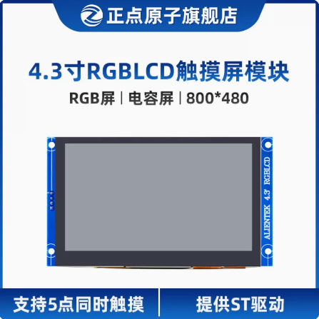
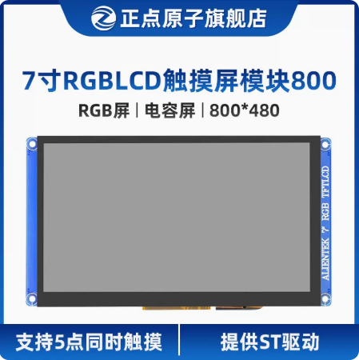
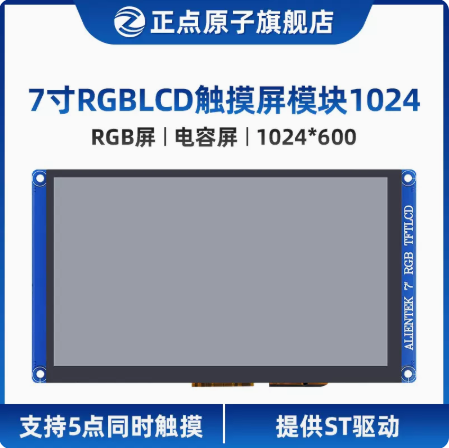
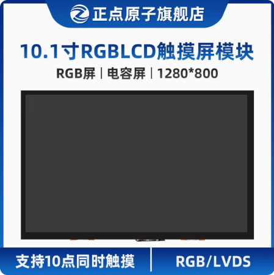
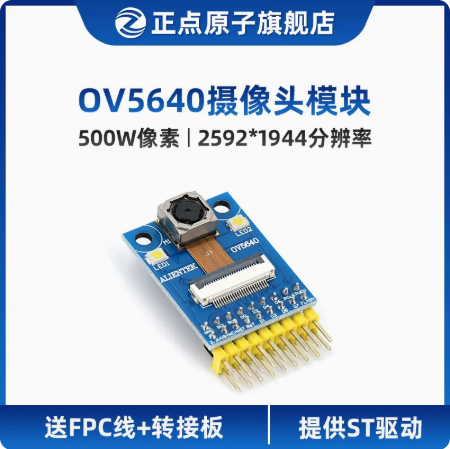
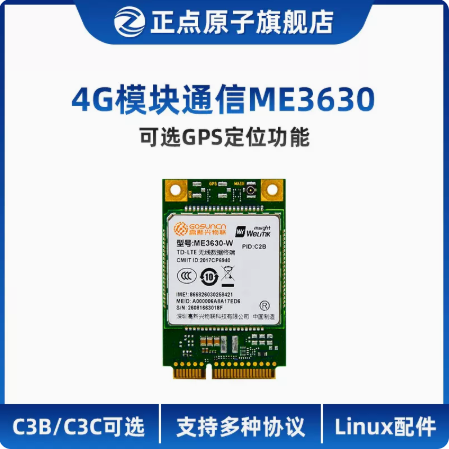
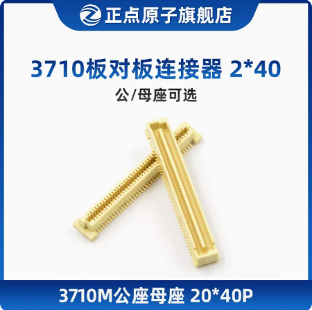
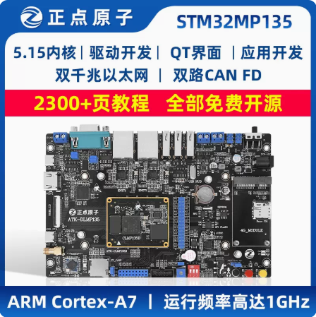

# 8 可选配件

&emsp;&emsp;ATK-CLMP135B核心板可以使用正点原子的ATK-CLMP135开发板，搭配OV5640摄像头、RGB屏幕、4G模块等，展现更强的性能效果。

&emsp;&emsp;天猫店铺链接：
https://zhengdianyuanzi.tmall.com/category-1498161504.htm?spm=a1z10.1-b.w5002-22300975822.4.5f821452e3PTLI&search=y&catName=ARM+Linux%BF%AA%B7%A2%B0%E5

&emsp;&emsp;目前开发板已经适配的模块如下（图片附带购买超链接）：

&emsp;&emsp;ATK-CLMP135B核心板上自带一对2*40PIN的3710F母座，用户在制作底板时，底板上需要使用一对2*40PIN的3710M公座。