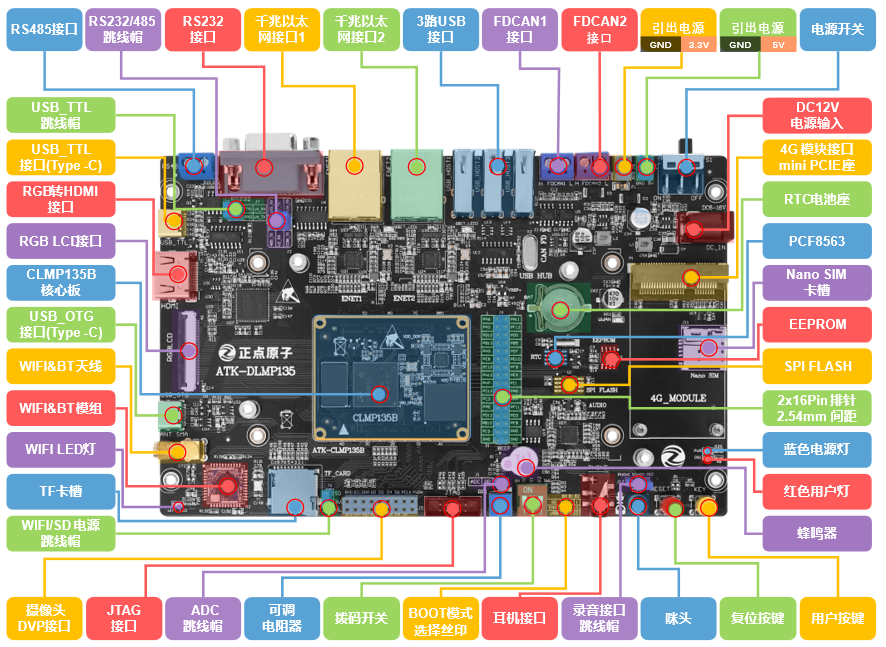

# 1.1.1 ATK-DLMP135开发板底板资源

&emsp;&emsp;首先，我们来看一下ATK-DLMP135开发板的底板资源图，如下图所示：

 
图1.1.1.1 ATK-DLMP135开发板底板资源图

&emsp;&emsp;从上图可以看出，ATK-DLMP135开发板底板资源十分丰富，扩充了丰富的接口和功能模块。开发板的外形尺寸为180mm*115mm大小，板子的设计充分考虑了人性化设计，便于开发使用。

&emsp;&emsp;正点原子ATK-DLMP135开发板底板板载资源如下： 
&emsp;&emsp;◆	1个核心板接口，支持ATK-CLMP135B核心板 
&emsp;&emsp;◆	1个电源指示灯（蓝色） 
&emsp;&emsp;◆	1个状态指示灯（红色，用户可使用） 
&emsp;&emsp;◆	1个NOR FLASH芯片，W25Q128 
&emsp;&emsp;◆	1个EEPROM芯片，AT24C64 
&emsp;&emsp;◆	1个RTC时钟芯片，PCF8563 
&emsp;&emsp;◆	1个高性能音频编解码芯片，CS42L51 
&emsp;&emsp;◆	2路CAN FD接口 
&emsp;&emsp;◆	3路USB2.0 HOST接口  
&emsp;&emsp;◆	2路10M/100M/1000M以太网接口（RJ45） 
&emsp;&emsp;◆	1路RS232串口（母）接口 
&emsp;&emsp;◆	1路RS485接口 
&emsp;&emsp;◆	1个RS232/RS485选择接口 
&emsp;&emsp;◆	1路USB_TTL调试串口，Type-C接口类型 
&emsp;&emsp;◆	1个串口连接接口 
&emsp;&emsp;◆	1路RGB转HDMI接口 
&emsp;&emsp;◆	1路RGB LCD屏幕接口 
&emsp;&emsp;◆	1路USB OTG接口，Type-C接口类型 
&emsp;&emsp;◆	1路WIFI&BT天线接口 
&emsp;&emsp;◆	1个SDIO WIFI&BT模块 
&emsp;&emsp;◆	1个TF卡接口 
&emsp;&emsp;◆	1个WIFI&TF卡供电选择接口 
&emsp;&emsp;◆	1路摄像头模块接口 
&emsp;&emsp;◆	1个JTAG调试接口 
&emsp;&emsp;◆	1个可调电位器，用于ADC测试 
&emsp;&emsp;◆	1个ADC连接接口 
&emsp;&emsp;◆	1个有源蜂鸣器 
&emsp;&emsp;◆	1个启动模式选择配置接口 
&emsp;&emsp;◆	1路耳机接口，支持4段式耳机 
&emsp;&emsp;◆	1个录音头（MIC/咪头） 
&emsp;&emsp;◆	1个小扬声器（在板子背面） 
&emsp;&emsp;◆	1个录音选择接口 
&emsp;&emsp;◆	1个Mini PCIE 4G模块接口 
&emsp;&emsp;◆	1个Nano SIM卡接口 
&emsp;&emsp;◆	1组5V电源输出口 
&emsp;&emsp;◆	1组3.3V电源输出口 
&emsp;&emsp;◆	1个DC12V电源输入接口（输入电压范围：DC6~16V）  
&emsp;&emsp;◆	1个电源开关，控制整个板的电源 
&emsp;&emsp;◆	1个RTC后备电池座，并带电池 
&emsp;&emsp;◆	1个复位按键，可用于复位MPU和LCD 
&emsp;&emsp;◆	1个用户按键 
&emsp;&emsp;◆	1组2×16P，2.54mm间距的排针，引出29个IO，用户可自行使用

&emsp;&emsp;正点原子ATK-DLMP135开发板底板的特点包括： 
&emsp;&emsp;1)、接口丰富。板子提供十来种标准接口，可以方便地进行各种外设的实验和开发。 
&emsp;&emsp;2)、设计灵活。采用核心板+底板形式，板上很多资源都可以灵活配置，以满足不同条件下的使用。我们引出了121个通用GPIO引脚，以及9个其他功能引脚(USB、NJTRST、VBAT等)，3个VCC_5V引脚及27个GND引脚，共160PIN，极大地方便大家扩展及使用。  
&emsp;&emsp;3)、资源丰富。板载高性能音频编解码芯片、千兆网卡、EEPROM存储芯片以及各种接口芯片，满足多种应用需求。 
&emsp;&emsp;4)、人性化设计。各个接口都有丝印标注，使用起来一目了然；部分常用外设大丝印标出，方便查找；接口位置设计合理，方便使用。

