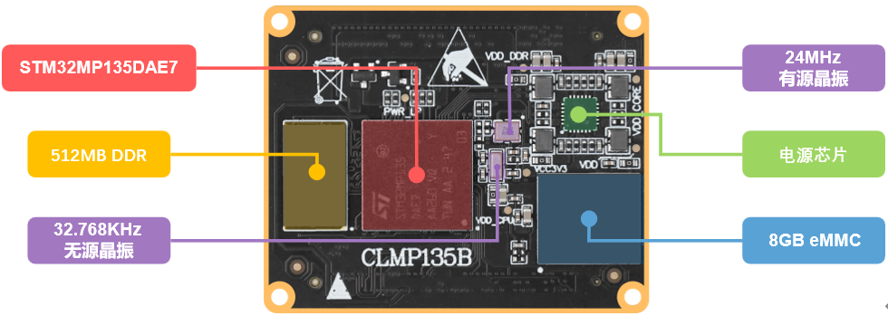

# 1.1.2 ATK-CLMP135B核心板资源

&emsp;&emsp;下面我们来看ATK-CLMP135B核心板，如下图所示：

 
图1.1.2.1 ATK-CLMP135B核心板

&emsp;&emsp;整个核心板的外形尺寸为50mm*40mm大小，非常小巧，并且采用了贴片板对板连接器，可以很方便地应用在各种项目上。

&emsp;&emsp;正点原子ATK-CLMP135B核心板板载资源如下： 
&emsp;&emsp;◆	CPU：STM32MP135DAE7，单核Cortex-A7，主频1GHz，LFBGA289封装。 
&emsp;&emsp;◆	外扩DDR3L：容量为512MB，位宽16位。 
&emsp;&emsp;◆	EMMC：容量为8GB。 
&emsp;&emsp;◆	两个2*40的防反插BTB座，共引出121个GPIO以及9个其他功能引脚。

&emsp;&emsp;正点原子ATK-CLMP135B核心板的特点包括： 
&emsp;&emsp;1)、体积小巧。核心板仅50mm*40mm大小，方便使用到各种项目里面。 
&emsp;&emsp;2)、集成方便。核心板使用160P BTB连接座，可以非常方便地集成到客户PCB上，更换简单，方便维修测试。 
&emsp;&emsp;3)、资源丰富。核心板板载：512MB DDR3L、8GB EMMC存储器，可以满足多种应用需求。 
&emsp;&emsp;4)、性能稳定。核心板采用8层板设计，单独地层、电源层，且关键信号采用等长线走线，保证运行稳定、可靠。 
&emsp;&emsp;5)、人性化设计。按功能分区引出IO口，方便布线。

