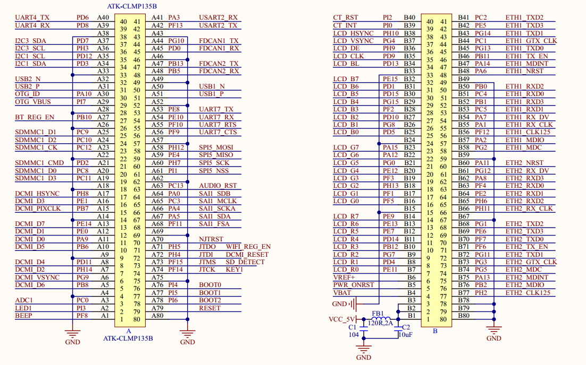
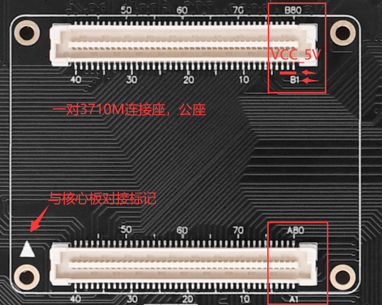

# 1.3.1 核心板接口

&emsp;&emsp;ATK-DLMP135开发板采用底板+核心板的形式，开发板底板采用2个2*40的3710M（公座）板对板连接器来与核心板连接，接插非常方便，底板上面的核心板接口原理图如下图所示：

 
图1.3.1.1 底板转接板接口部分原理图

&emsp;&emsp;图中的A和B就是底板上的连接座接口，由2个2*40PIN的3710M板对板公座组成，包含121个GPIO、9个其他功能引脚、27个GND引脚和3个5V电源输入引脚，组成160PIN。

 
图1.3.1.2 底板转接板接口实物图

&emsp;&emsp;用户在设计底板时，需注意连接座的定义顺序，不要接反了方向。图中B1 ~ B3引脚是供电VCC_5V电源输入引脚，供电核心板，B78 ~ B80是连续3个GND引脚，其他引脚类推。

