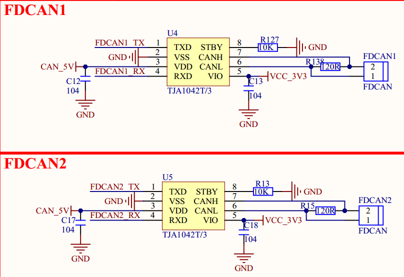

# 1.3.10 FDCAN接口

&emsp;&emsp;ATK-DLMP135开发板板载2路FDCAN接口电路，如图1.3.10.1所示：

 
图1.3.10.1 FD CAN接口电路

&emsp;&emsp;CAN总线电平也不能直接连接到STM32MP135，同样需要电平转换芯片。原理图这里使用TJA1042T（也可用其他支持CANFD电平转换芯片）来做CAN电平转换，支持CAN和CAN FD协议。

