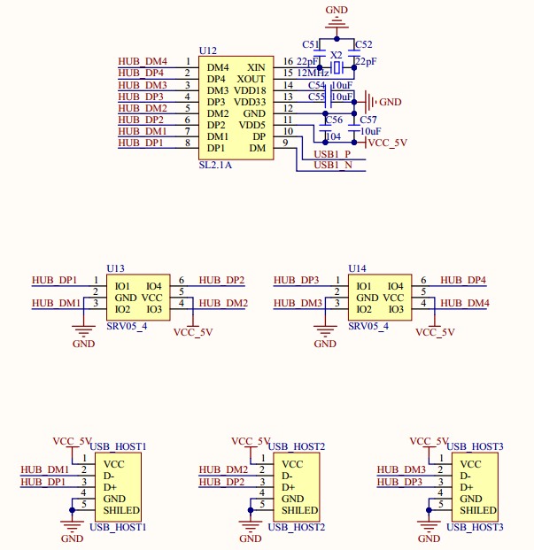

# 1.3.11 USB HUB接口

&emsp;&emsp;ATK-DLMP135开发板板载了一颗一扩四的USB HUB芯片，用于将STM32MP135的USB1扩展为4个USB HOST接口(其中1路连接4G模块，剩余3路可以外接其他USB设备)，如图1.3.11.1所示：

 
图1.3.11.1 USB HUB接口电路

&emsp;&emsp;STM32MP135带有两个USB接口，但是对于Linux应用来说两个USB太少了，如果我们要连接鼠标、键盘、U盘等设备的时候两个USB口完全不够用。因此STM32MP135开发板通过SL2.1A芯片将STM32MP135的USB1外扩出了4个USB HOST接口，其中有一路外接了4G模块，因此提供给用户的有3个USB HOST接口。
