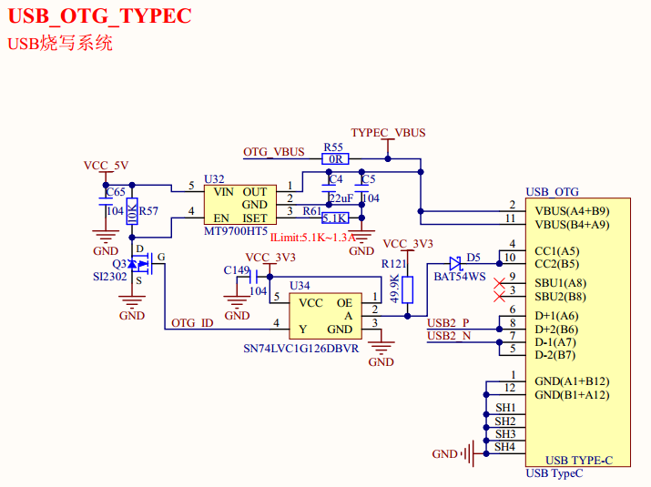

# 1.3.12 USB OTG(Type-C)接口

&emsp;&emsp;STM32MP135也有一路USB OTG接口，USB OTG接口使用了STM32MP135的USB2，USB OTG接口如图1.3.12.1所示：

 
图1.3.12.1 USB OTG接口

&emsp;&emsp;USB_OTG电路既可以作为USB从机，也可以作为USB主机。图1.3.12.1中右侧的USB_OTG就是Type-C座，我们就是通过此USB Type-C座进行系统烧写以及进行USB OTG测试，如果需要做USB OTG测试，那么还需要购买一根Type-C OTG线。STM32MP135默认当从机模式，这里为了支持USB主机模式，添加三态缓冲器器件，当OTG转接线接入U盘时，能够拉低OTG_ID引脚，进而让处理器进入USB主机模式。如果用户设计底板USB接口不使用Type-C接口，那可以用Micro USB接口代替，此时USB-OTG电路则不需要加入三态缓冲器。