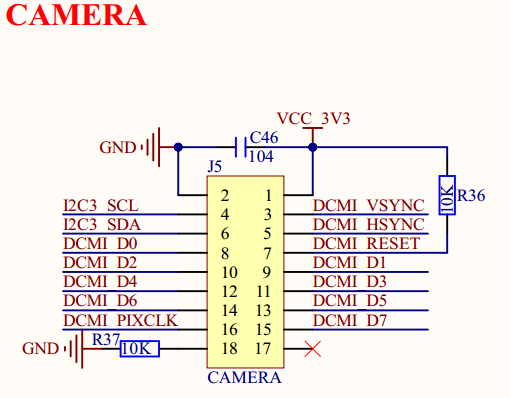

# 1.3.17 摄像头模块接口  

&emsp;&emsp;ATK-DLMP135开发板板载了一个摄像头模块接口，连接在STM32MP135的硬件摄像头接口（DCMIPP）上面，其原理图如图1.3.17.1所示：

 
图1.3.17.1 摄像头模块接口

&emsp;&emsp;图中J5接口可以用来连接正点原子摄像头模块。其中，I2C3_SCL和I2C3_SDA是摄像头的SCCB接口，分辨连接在STM32MP135的PH3和PD7引脚上。该J5接口第 18号引脚为正点原子摄像头OV系列摄像头的PWDN引脚，为掉电模式，高电平有效，本开发板没有使用该模式，默认配置下拉。用户若有需要，则可设计底板时，配置一个IO来控制。DCMI_RESET 和DCMI_PWDN这2个信号是不属于STM32MP135硬件摄像头接口的信号，通过普通IO控制即可。

&emsp;&emsp;此外，DCMI_VSYNC/DCMI_HSYNC/DCMI_D0~DCMI_D7/DCMI_PIXCLK等信号接在了STM32MP135的硬件摄像头接口DCMIPP。 

