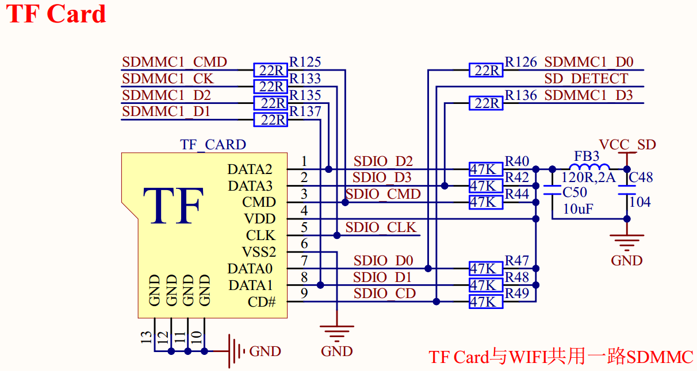

# 1.3.19 TF卡接口 

&emsp;&emsp;ATK-DLMP135开发板板载了一个TF卡（小卡）接口，其原理图如图1.3.19.1所示：

 
图1.3.19.1 TF卡接口  

&emsp;&emsp;图中TF_CARD为TF卡接口，TF卡采用4位SDMMC方式驱动，非常适合需要高速存储的情况。图中：SDMMC1_D0~D3/SDMMC1_CK/SDMMC_CMD分别连接在STM32MP135的PC8、PC9、PC10、PC11、PC12和PD2引脚上。由于STM32MP135只有2组SDMMC通信接口，其中一组SDMMC2用于核心板上EMMC存储芯片，另一组引出到底板，故TF卡和SDIO WIFI模组共用同一组SDMMC1总线，它们不能同时工作，需要进行供电切换。SD_DETECT是TF卡检测引脚，用于检测TF卡插拔过程，连接到STM32MP135的PF15引脚上。

