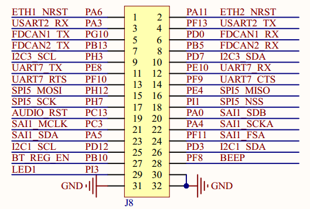

# 1.3.2 引出IO口

&emsp;&emsp;ATK-DLMP135开发板底板上面，通过2x16排针组引出了29个IO口，如下图所示：

 
图1.3.2.1 引出IO口

&emsp;&emsp;图中J8就是引出的IO，一共29个IO，加上引出3个GND，组成2x16排针组，大家可以使用这些IO连接一些其他模块，进行更多有意思的创新。这里特别提示，在单独使用指定IO时，不能和开发板功能有冲突，不要同时使用，需要进行系统复用功能的更改。另外需要检查底板功能电路对这些IO的配置情况，比如进行了电阻上下拉、并联电容等，如影响使用，则需要手动移除。

