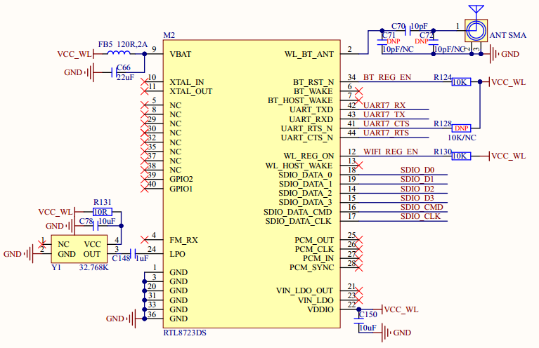
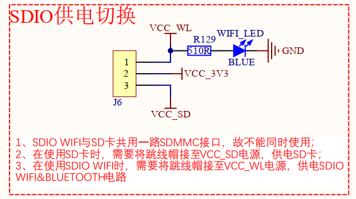

# 1.3.20 SDIO WIFI&蓝牙模块 

&emsp;&emsp;ATK-DLMP135开发板板载一个SDIO WIFI&蓝牙模块，如图1.3.20.1所示：

 
图1.3.20.1 SDIO WIFI&蓝牙接口

 
图1.3.20.2 SDIO WIFI&蓝牙接口

&emsp;&emsp;WIFI&蓝牙模块使用RTL8723DS，这是一个SDIO接口的WIFI&蓝牙模块，连接到了STM32MP135的SDMMC1接口上，与TF卡共用同一组接口，两者不能同时使用。开发板采用切换供电方式，让用户能够切换使用TF卡功能和WIFI&蓝牙模块。

&emsp;&emsp;蓝牙部分使用到了串口，模块的UART_TX/UART_RX/UART_CTS/UART_RTS连接到了STM32MP135的UART7串口上，对应的引脚为PE8/PE10/PF9/PF10。BT_REG_EN和WIFI_REG_EN这2个IO连接到了STM32MP137的PB10和PH5引脚上。

&emsp;&emsp;由于MPU引脚数目较少，开发板在裁剪引脚时没有使用BT_WAKE/BT_HOST/WAKE/WL_HOST_WAKE引脚及PCM功能，用户设计底板时可按项目需求及对应WIFI&蓝牙模组厂商的设计要求进行新增控制。本电路仅供参考。

