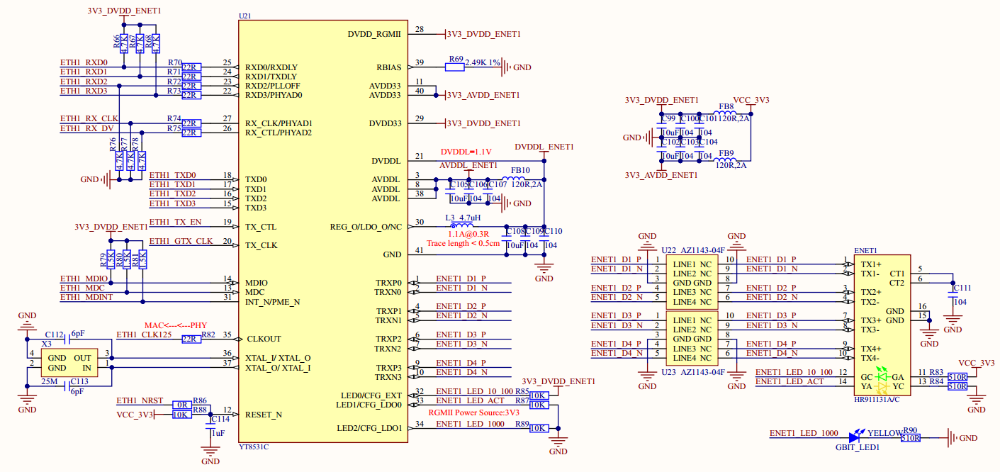

# 1.3.22 千兆以太网接口（RJ45）

&emsp;&emsp;ATK-DLMP135开发板板载了2路千兆以太网接口(RJ45)，原理图如图1.3.22.1所示：

 
图1.3.22.1 千兆网络原理图 

&emsp;&emsp;此处示例为ENET1网络1原理图，ENET2网络2同理，注意区分网络地址，网口1地址为1，网口2地址为2。STM32MP135内部自带2个千兆网络MAC控制器，因此可以提供2个千兆网口，开发板选用网络PHY芯片型号为YT8531C。GBIT_LED1是一个黄绿色的LED灯，由ENET1_LED_1000控制，如果网络工作在千兆则此LED灯会常亮。此处建议采用四层线路板设计千兆网络，否则二层线路板未能保持完整参考平面，导致网速未能达到近千兆速率。

