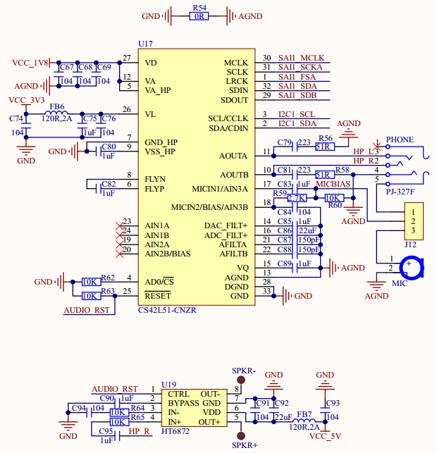

# 1.3.23 SAI音频编解码器 

&emsp;&emsp;ATK-DLMP135开发板板载CS42L51高性能音频编解码芯片，其原理图如图1.3.23.1所示：

 
图1.3.23.1 SAI音频编解码芯片

&emsp;&emsp;CS42L51是一颗低功耗、高性能的立体声多媒体数字信号编解码器，该芯片内部集成了24位高性能DAC&ADC。不仅如此，该芯片还结合了立体声麦克风的前置放大、立体声耳机减少了应用时必需的外部组件，直接可以驱动耳机（46mW 16Ω@1.8V或88mW 16Ω@2.5V）。

&emsp;&emsp;图1.3.23.1中，HT6872是有一个单声道D类音频功放，因为CS42L51不支持喇叭，因此需要外置喇叭驱动电路。SPK-和SPK+连接了一个板载的8Ω 1W小喇叭（在开发板背面）。麦克风有两种选择，一个是耳机自带的MIC，一个是板载的咪头，这两个只能二选一，通过J12跳线帽来选择。PHONE是一个四段式3.5mm耳机输出接口，可以用来插耳机。

&emsp;&emsp;该芯片采用SAI接口与STM32MP135连接，图中：SAI1_MCLK/SAI1_SCKA/SAI2_FSA/SAI1_SDA/SAI1_SDB/分别接在STM32MP135的：PC3/PA4/PF11/PA5/PA0上。

&emsp;&emsp;CS42L51需要一个I2C接口去配置，这里使用STM32MP135的I2C1，I2C1_SCL和I2C1_SDA分别连接到了STM32MP135的PD12和PD3这两个引脚上。

