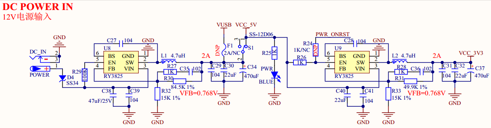

# 1.3.24 电源供电

&emsp;&emsp;ATK-DLMP135开发板板载的电源供电部分，其原理图如图1.3.24.1所示：

 
图1.3.24.1 电源供电

 
图1.3.24.2 BOOT启动模式供电

&emsp;&emsp;图中共有2个DCDC电源芯片，即U8和U9。DC_IN用于外部DC12V直流电源输入，经过U8 DCDC芯片转换为5V电源输出，给核心板及其他电路供电。其中D4是防反接二极管，避免外部直流电源极性搞错的时候，烧坏开发板。S1为开发板的总电源开关，F1为2A自恢复保险丝，用于保护USB，这里没有使用USB供电开发板。U9为输出3.3V DCDC芯片，给开发板提供3.3V电源。 

&emsp;&emsp;**这里注意一点**，由于底板U9电源芯片输出VCC_3V3会给BOOT拨码开关进行供电，涉及到MPU启动模式选择，所以需要底板在VCC_5V供电到核心板后，U9电源芯片必须尽快（**3ms内**）建立输出3.3V高电平，即VCC_3V3，让MPU读取到对应BOOT启动模式进行系统启动。开发板通过R26电阻直接输入U9使能EN引脚，实现U9电源VCC_3V3输出。

&emsp;&emsp;强调一下，U9电源芯片即5V转3.3V电源芯片，在选型DCDC芯片时，须选择软启动时间在2ms内的电源芯片，才能在VCC_5V供电核心板后，MPU读取到正确的BOOT启动电平。

