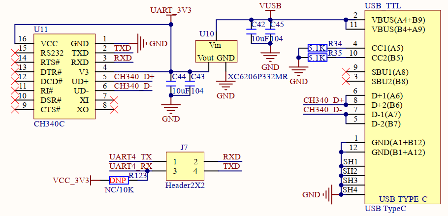

# 1.3.26 USB串口(Type-C接口)   

&emsp;&emsp;ATK-DLMP135开发板板载了一个USB串口，其原理图如图1.3.26.1所示：

 
图1.3.26.1 USB串口

&emsp;&emsp;USB转串口，开发板选择的是CH340C，CH340C内置晶振，因此就不需要再在外面连接一个晶振。图中可以看出CH340C的电源为3.3V，并且是独立供电的，U10是一个LDO芯片，负责给CH340C提供3.3V的电源。CH340C的电源不受开发板电源开关控制，只要接上USB线CH340就会上电。图中RXD/TXD接J7的RXD/TXD，是CH340芯片的串口接收和发送脚，可以通过跳线帽连接到STM32MP135的串口4上。

