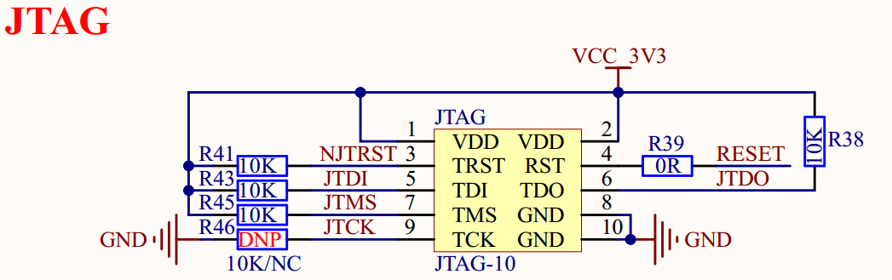

# 1.3.27 JTAG接口 

&emsp;&emsp;ATK-DLMP135开发板板载一个10针，2.0mm间距的JTAG接口，原理图如图1.3.27.1所示：

 
图1.3.27.1 JTAG接口

&emsp;&emsp;开发板将部分JTAG引脚用作普通GPIO，与其他功能共用，它们不能同时使用。如果用户需要单独的JTAG引脚电路，可在设计底板时保留JTAG引脚不与其他功能引脚共用。JTAG引脚内置上下拉电阻（30~50K），可以省略外部上下拉电阻。

&emsp;&emsp;当用户需要使用JTAG接口进行调试时，需要切换BOOT启动模式B2为高电平，B1、B0为低电平，即开发启动模式。

