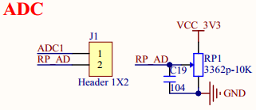

# 1.3.28 可调电阻器 

&emsp;&emsp;ATK-DLMP135开发板板载一个可调电阻器，用来完成ADC采集实验，电路如图1.3.28.1所示：

 
图1.3.28.1 可调电阻器

&emsp;&emsp;图1.3.28.1中RP1是一个10K的可调电阻器，RP_AD为抽头，可以通过J1将RP_AD连接到ADC1上，ADC1连接到了STM32MP135的PC0引脚上，可以完成AD采集。如果不需要ADC功能，可将PC0引脚复用成其他功能。

