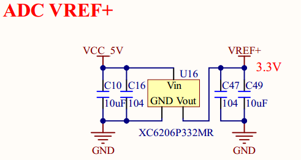

# 1.3.29 ADC参考电压VREF+ 

&emsp;&emsp;ATK-DLMP135开发板使用一个LDO来提供ADC参考电压，电路如图1.3.29.1所示：

 
图1.3.29.1 ADC参考电压

&emsp;&emsp;开发板使用的LDO型号为XC6206P332MR，提供3.3V电压供给ADC VREF+，以正常使用ADC功能。用户可以改用其他LDO来提供ADC VREF+参考电压，注意不能超过3.3V，核心板上面的VDDA是3.3V供电。

