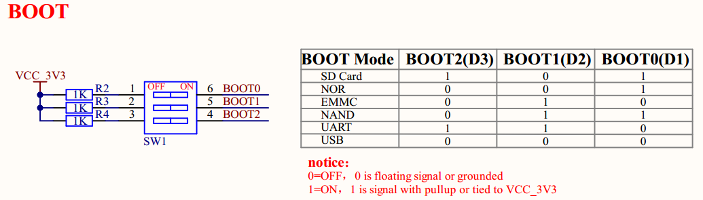

# 1.3.6 启动模式设置接口

&emsp;&emsp;ATK-DLMP135开发板的BOOT启动模式设置接口电路如图1.3.6.1所示：

 
图1.3.6.1 启动模式设置接口

&emsp;&emsp;STM32MP135支持从多种不同的设备启动，通过设置拨码开关可以选择从指定的设备启动，启动方式如表1.3.6.1所示：

<table class="stm32mp135_center-table">
  <tr>
    <th>BOOT2(D3)</th>
    <th>BOOT1(D2)</th>
    <th>BOOT0(D1)</th>
    <th>启动模式</th>
  </tr>
  <tr>
    <td>1</td>
    <td>0</td>
    <td>1</td>
    <td>SD卡启动</td>
  </tr>
  <tr>
    <td>0</td>
    <td>0</td>
    <td>1</td>
    <td>NOR启动</td>
  </tr>
  <tr>
    <td>0</td>
    <td>1</td>
    <td>0</td>
    <td>EMMC启动</td>
  </tr>
  <tr>
    <td>0</td>
    <td>1</td>
    <td>1</td>
    <td>NAND启动</td>
  </tr>
  <tr>
    <td>1</td>
    <td>1</td>
    <td>0</td>
    <td>USB/UART启动</td>
  </tr>
  <tr>
    <td>0</td>
    <td>0</td>
    <td>0</td>
    <td>USB/UART启动</td>
  </tr>
  <tr>
    <td>1</td>
    <td>0</td>
    <td>0</td>
    <td>Development boot (noflash memory boot)</td>
  </tr>
</table>

&emsp;&emsp;正点原子ATK-DLMP135开发板上支持USB、SD卡、EMMC启动方式。STM32MP135还
支持一种开发启动模式Development boot (no flash memory boot)，可用JTAG接口进行调试，ATK-DLMP135开发板也同样支持。

