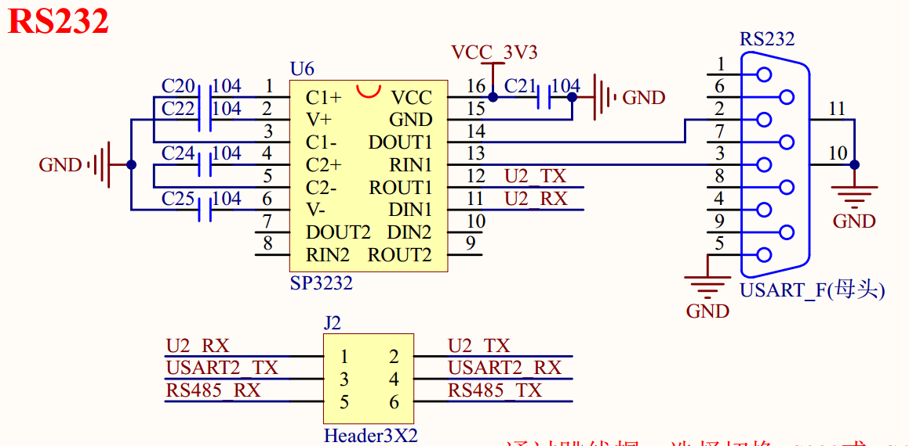

# 1.3.8 RS232串口

&emsp;&emsp;ATK-DLMP135开发板板载了1个RS232接口（母头），电路原理图如图1.3.8.1所示：

 
图1.3.8.1 RS232串口及选择接口

&emsp;&emsp;因为RS232电平不能直接连接到STM32MP135，所以需要一个电平转换芯片。原理图这里选用SP3232（也可用其他RS232电平转换芯片）来做RS232电平转接。同时图中的J2用来实现RS232(母头)/RS485的选择。所以RS232(母头)/RS485都是通过串口2来实现的。

