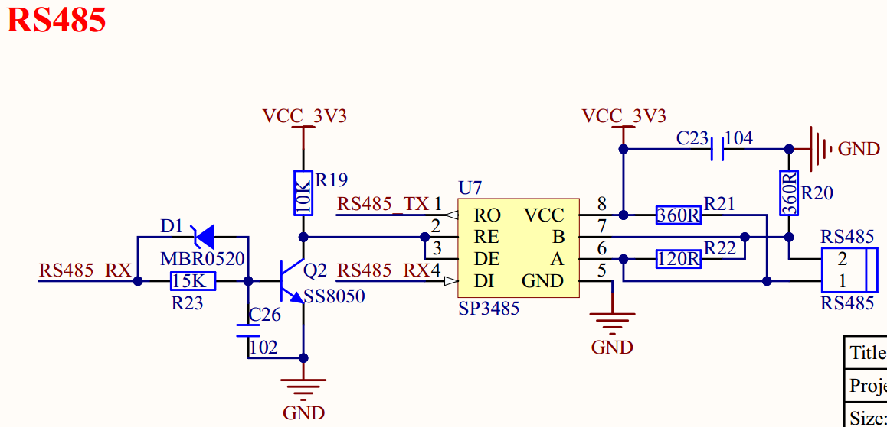
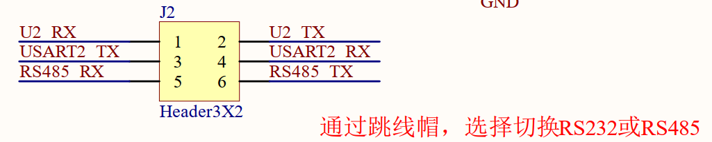

# 1.3.9 RS485接口

&emsp;&emsp;ATK-DLMP135开发板板载的RS485接口电路如图1.3.9.1所示：

 
图1.3.9.1 RS485接口

 
图1.3.9.2 RS485/RS232选择接口

&emsp;&emsp;RS485电平也不能直接连接到STM32MP135，同样需要电平转换芯片。原理图这里选用SP3485（也可用其他RS485电平转换芯片）来做RS485电平转换，其中R22为终端匹配电阻，而R21和R22则是两个偏置电阻，以保证静默状态时485总线维持逻辑1。

&emsp;&emsp;RS485_RX/RS485_TX连接在J2上面，通过J2跳线来选择是否连接在STM23MP135上面。当使用RS485时，需将RS485_RX连接到USART2_TX引脚，将RS485_TX连接到USART2_RX引脚。SP3485的RE引脚连接通过一系列的电路连接到了RS485_RX引脚上，这样就可以通过RS485_RX引脚来控制RS485的接收和发送状态，完全将RS485当做一个串口来使用。

