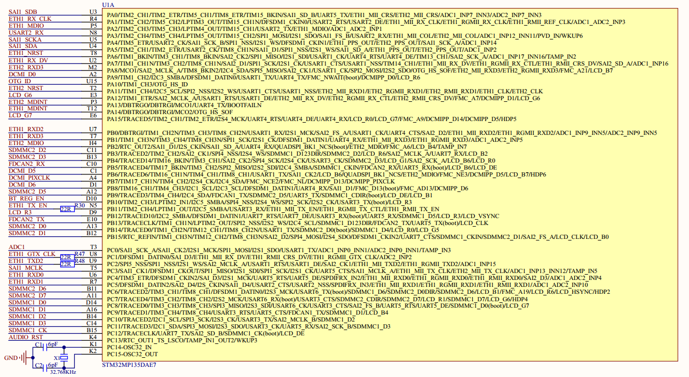
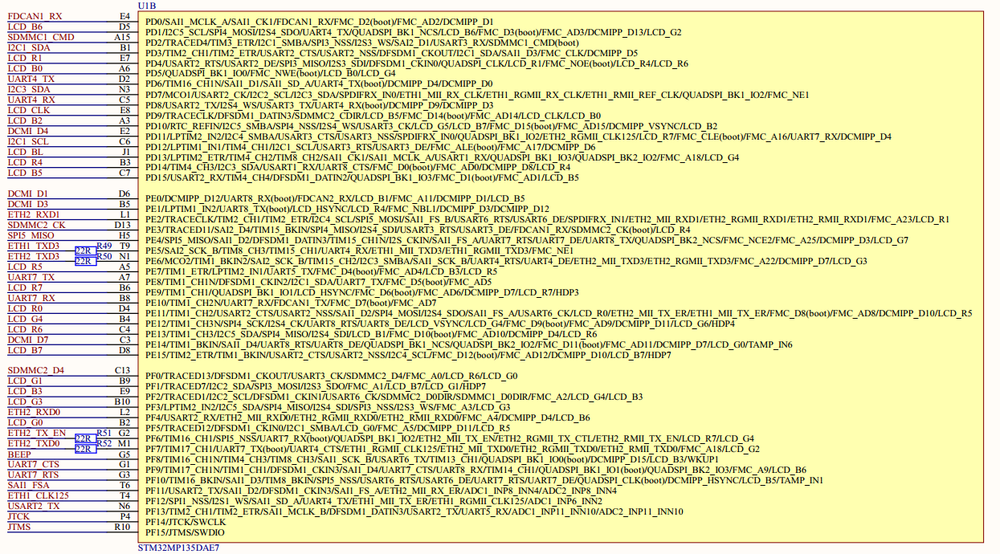
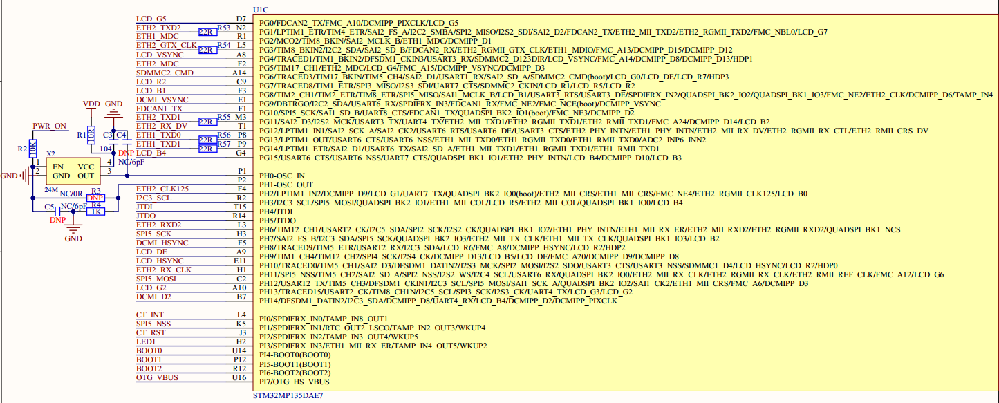
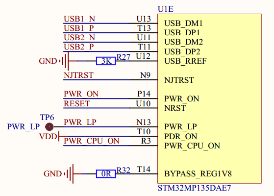
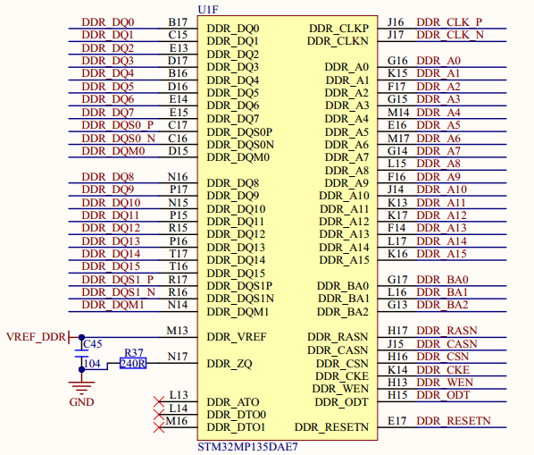
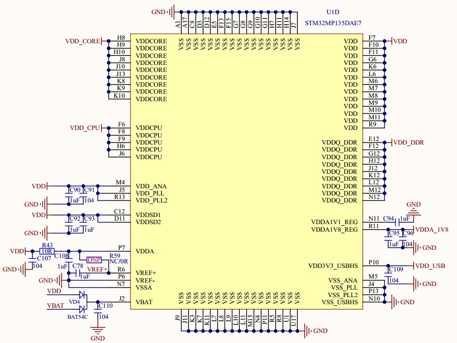

# 1.4.1 SOC

&emsp;&emsp;ATK-DLMP135开发板配套的ATK-CLMP135B核心板，采用STM32MP135DAE7作为主控CPU，单核A7，最高1GHz主频。该SOC自带32KB的L1指令和数据Cache、128KB的L2 Cache，集成NEON和TrustZone，集成双精度硬件浮点计算单元VFPv4，并具有168KB SRAM、2个高级定时器、10个通用定时器、2个基础定时器、5个低功耗定时器、2个watchdog、1个FMC接口、1个QUADSPI接口、2个ADC外设、1个内嵌的数字温度传感器、1个DFSDM外设、1个DCMIPP接口、1个RGB LCD控制器(LTDC)、1个内嵌RTC、8个UART/USART、5个SPI、5个I2C、2个SAI、4个SPDIFRX输入通道、2个千兆网络MAC控制器、2个USB控制器、2个SDMMC接口、2个FDCAN接口等。

&emsp;&emsp;SOC部分的原理图如图1.4.1.1~图1.4.1.5（请打开开发板资料的原理图进行查看）所示：

 
图1.4.1.1 SOC部分原理图1

 
图1.4.1.2 SOC部分原理图2

 
图1.4.1.3 SOC部分原理图3

 
图1.4.1.4 SOC部分原理图4

 
图1.4.1.5 SOC部分原理图5

 
图1.4.1.6 SOC部分原理图6

&emsp;&emsp;STM32MP135芯片的原理图由6个部分组成，接下来依次看一下这6部分的具体内容： 
&emsp;&emsp;图1.4.1.1：此部分原理图主要是STM32MP135的GPIOA ~ C这部分IO原理图。 
&emsp;&emsp;图1.4.1.2：此部分原理图主要是STM32MP135的GPIOD ~ F这部分IO原理图。 
&emsp;&emsp;图1.4.1.3：此部分原理图主要是STM32MP135的GPIOG ~ I这部分IO原理图。 
&emsp;&emsp;图1.4.1.4：此部分原理图主要是STM32MP135的USB、电源控制等引脚。 
&emsp;&emsp;图1.4.1.5：此部分原理图是STM32MP135的DDR引脚。 
&emsp;&emsp;图1.4.1.6：此部分原理图是STM32MP135的电源部分。

