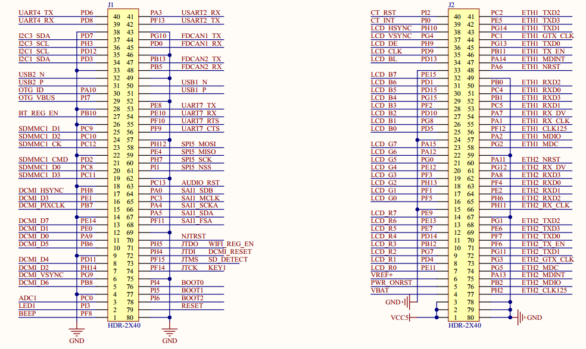

# 1.4.2 BTB接口

&emsp;&emsp;ATK-CLMP135B核心板采用2个2*40的3710F（母座）板对板连接器来同底板连接(在底面)，接插非常方便，核心板上面的底板接口原理图如图1.4.2.1所示：

 
图1.4.2.1 底板接口

&emsp;&emsp;图中，JP1和JP2是2个2*40的板对板母座（3710F），和底板的接插非常方便，方便大家嵌入自己的项目中去。该接口总共引出121个IO口，另外，还有USB、电源、复位、VREF+等信号。

